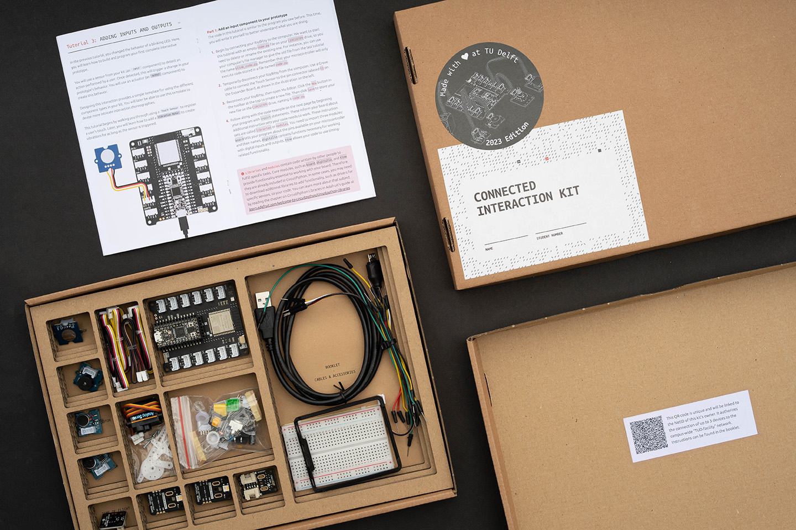

# About the Connected Interaction Kit

## Purpose

Design students are expected to learn a diverse set of skills. One of those skills is understanding and tinkering with interactive technology to build prototypes fit for communicating ideas, understanding limitations of the design, and testing usability with users.

The Connected Interaction Kit functions as a stepping stone for students to develop their skills in creating interactive prototypes using micro electronics. It provides a versatile collection of tools and components to build on as you grow your abilities — from a wearable companion device, to an interactive desk lamp, to a connected ecosystem that bridges the physical and digital world.

It is used as part of the design curriculum at the [Faculty of Industrial Design Engineering](https://www.tudelft.nl/io) at Delft University of Technology.

---

## The Ecosystem

The kit is fully open source and open hardware, spread across several repositories:

| Repository | Description |
| :--- | :--- |
| [Connected-Interaction-Kit](https://github.com/id-studiolab/Connected-Interaction-Kit) | This documentation site, production files for the physical kit (box, booklet), and 3D-printable accessories |
| [PicoExpander](https://github.com/id-studiolab/PicoExpander) | PCB design files and firmware for the Solderless Connector Board (the Expander) |
| [EduGroveModules](https://github.com/id-studiolab/EduGroveModules) | Custom sensors and actuators designed specifically for the kit |

---

## Open Hardware Status

The kit is mostly complete for open hardware purposes. The table below gives an overview of what is currently available:

| Asset | Status | Where to find it |
| :--- | :---: | :--- |
| Documentation website | ✅ Available | This site |
| Box assembly & packaging files | ✅ Available (2022–2026 editions) | [`/production_files/`](https://github.com/id-studiolab/Connected-Interaction-Kit/tree/main/production_files) in main repo |
| Printed booklet source files | ✅ Available (2022–2026 editions) | [`/production_files/`](https://github.com/id-studiolab/Connected-Interaction-Kit/tree/main/production_files) in main repo |
| 3D-printable accessories (STL) | ✅ Available | [`/accessories/`](https://github.com/id-studiolab/Connected-Interaction-Kit/tree/main/accessories) in main repo |
| Expander PCB design files | ✅ Available | [PicoExpander repo](https://github.com/id-studiolab/PicoExpander) |
| Custom component designs | ✅ Available | [EduGroveModules repo](https://github.com/id-studiolab/EduGroveModules) |
| CircuitPython project bundle | ✅ Available | [CIK-Project-Bundle releases](https://github.com/id-studiolab/CIK-Project-Bundle/releases/latest) |
| Bill of Materials | ✅ Available | [`BOM.md`](https://github.com/id-studiolab/Connected-Interaction-Kit/blob/main/BOM.md) in main repo |

---

## Adopt this Platform

Are you an educator or institution looking to build a similar prototyping kit for your own students? All design files, source code, and documentation are freely available under open licenses.

**What you get:**
- A complete set of box and packaging design files to reproduce the physical kit
- PCB design files for the Expander board to have it manufactured
- Circuit Python libraries and example code for all components
- This documentation website (Jekyll-based, easy to fork and adapt)

**Getting started:**
1. Browse the repositories listed above and fork what you need
2. The `/production_files/` folder contains everything needed to reproduce the physical packaging
3. Open an issue on the main repository if you have questions or want to share your adaptation

We'd love to hear how the kit is being used elsewhere — reach out via the GitHub repositories.

---

## Made by

The Connected Interaction Kit was designed and developed at the [ID StudioLab](https://www.tudelft.nl/io/over-io/faciliteiten/id-studiolab), Faculty of Industrial Design Engineering, TU Delft.

- [Aadjan van der Helm](https://www.tudelft.nl/io/over-io/personen/helm-ajc-van-der)
- [Martin Havranek](https://www.linkedin.com/in/martin-havranek-a6518118/)
- [Adriaan Bernstein](https://www.linkedin.com/in/adriaan-bernstein?miniProfileUrn=urn%3Ali%3Afs_miniProfile%3AACoAACH6qLkB6BPhbXD2YsJ04gpgO5T5qFIDnGQ&lipi=urn%3Ali%3Apage%3Ad_flagship3_search_srp_all%3Bm4VLWSAdT%2FWg8LyjZ7UchA%3D%3D)
- [Freddy Überschär](https://www.ueberschaer.design/about)
- [Jerry de Vos](https://www.linkedin.com/in/jerrydevos/)
