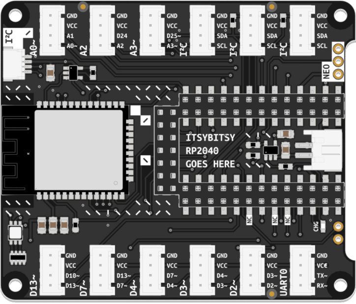

# Bitsy Expander

Your kit includes one of **two functionally equivalent versions of the Bitsy Expander**, depending on the edition of your Connected Interaction Kit. This page is designed to help you identify which version you own.

|                         2022 Edition                         |                         2023 Edition                         |
| :----------------------------------------------------------: | :----------------------------------------------------------: |
|               Expander Board for ItsyBitsy M4                |             Expander Board for ItsyBitsy RP2040              |
|  |  |
|                                                              |                                                              |
|      [Learn More](bitsy-expander-m4){: .btn .btn-blue }      |    [Learn More](bitsy-expander-rp2040){: .btn .btn-blue }    |

### Which Bitsy Expander do I have?

  

The easiest way to identify which Bitsy Expander flavor you own is checking the label on the back of the board. **RP2040** or **M4** stated on the label indicates the flavor of your Expander. Some M4 Expanders have an **empty label** (and are also recognizable by the lack of an I²C header at the top). 
