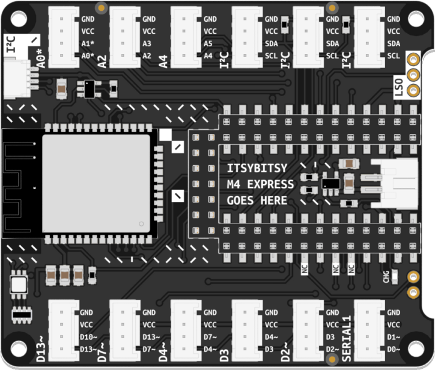

# Bluetooth
<a href="../../glossary/glossary"></a> <a href="../../glossary/glossary"></a>

With this modification you can use the bluetooth functionality of your ItsyBitsy Expander, it makes it possible to send and receive serial communication to your smartphone.  

## How to use bluetooth on your itsy bitsy expander:
### Solder the connections
At the back of the bitsy expander bridge the pins of the ESP_RX, ESP_TX, and GPIO_0 pads. As seen in the image below:  


<!-- 
image -->
  

Follow the rest of the instruction on this page:
[https://learn.adafruit.com/adafruit-airlift-breakout/circuitpython-ble](https://learn.adafruit.com/adafruit-airlift-breakout/circuitpython-ble)  
  
{:.note}
Once you reach the [BLE Example code](https://learn.adafruit.com/adafruit-airlift-breakout/circuitpython-ble#ble-example-3085843), use the Basic Usage code example below.  

---

## Basic Usage
 
```python
# SPDX-FileCopyrightText: 2020 Dan Halbert, written for Adafruit Industries
#
# SPDX-License-Identifier: Unlicense

# pylint: disable=unused-import
import board
import busio
from digitalio import DigitalInOut
from adafruit_ble import BLERadio
from adafruit_ble.advertising.standard import ProvideServicesAdvertisement
from adafruit_ble.services.nordic import UARTService
from adafruit_esp32spi import adafruit_esp32spi
from adafruit_airlift.esp32 import ESP32

esp32 = ESP32(
    reset=board.D12,
    gpio0=board.D10,
    busy=board.D11,
    chip_select=board.D9,
    tx=board.TX,
    rx=board.RX,
)

adapter = esp32.start_bluetooth()

ble = BLERadio(adapter)
uart = UARTService()
advertisement = ProvideServicesAdvertisement(uart)

while True:
    ble.start_advertising(advertisement)
    print("waiting to connect")
    while not ble.connected:
        pass
    print("connected: trying to read input")
    while ble.connected:
        # Returns b'' if nothing was read.
        one_byte = uart.read(1)
        if one_byte:
            print(one_byte)
            uart.write(one_byte)

```

