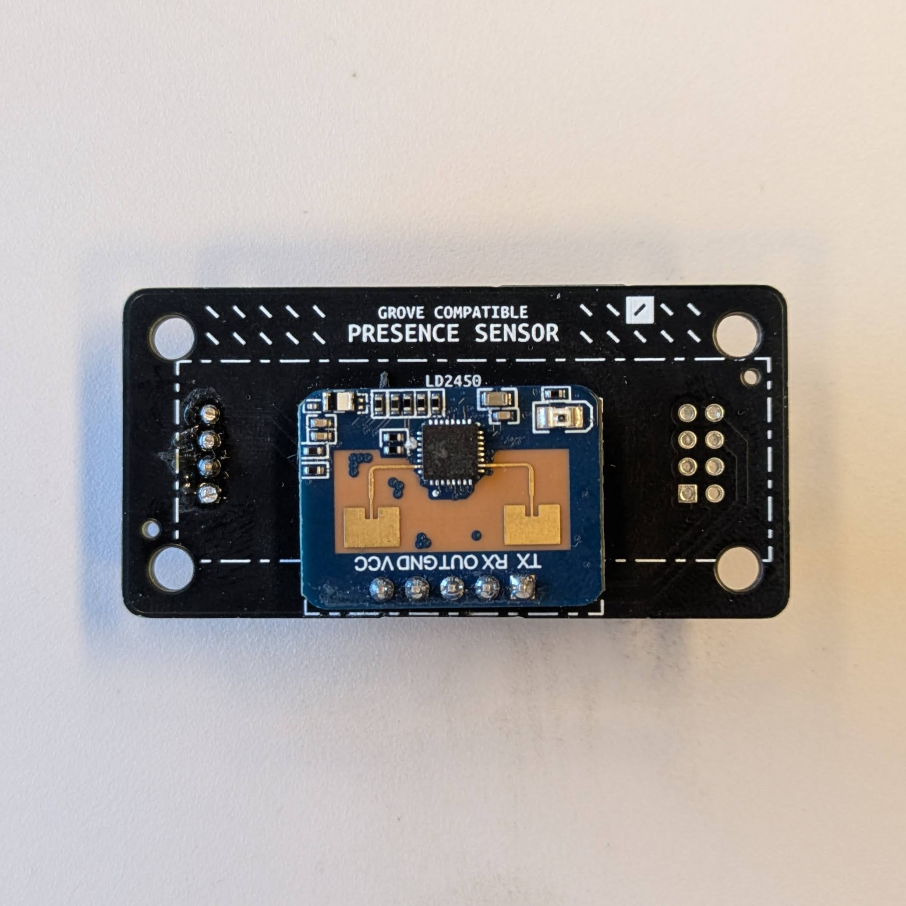
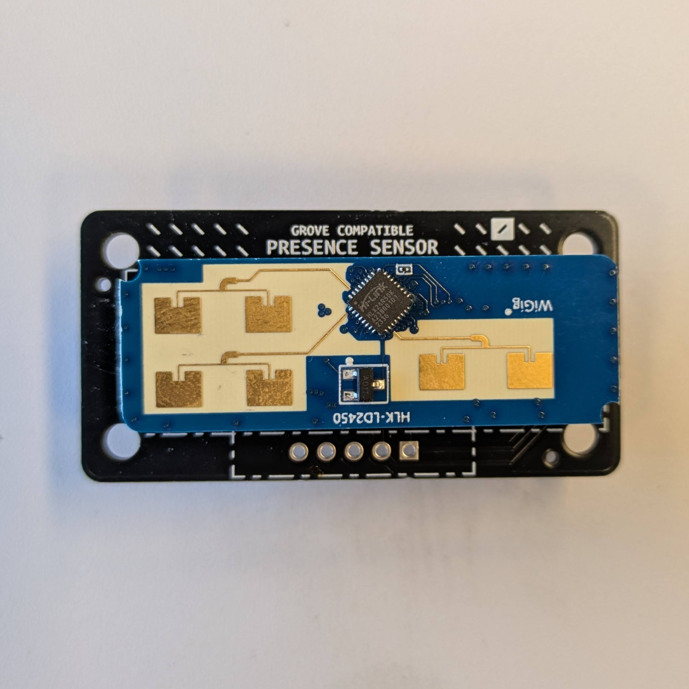
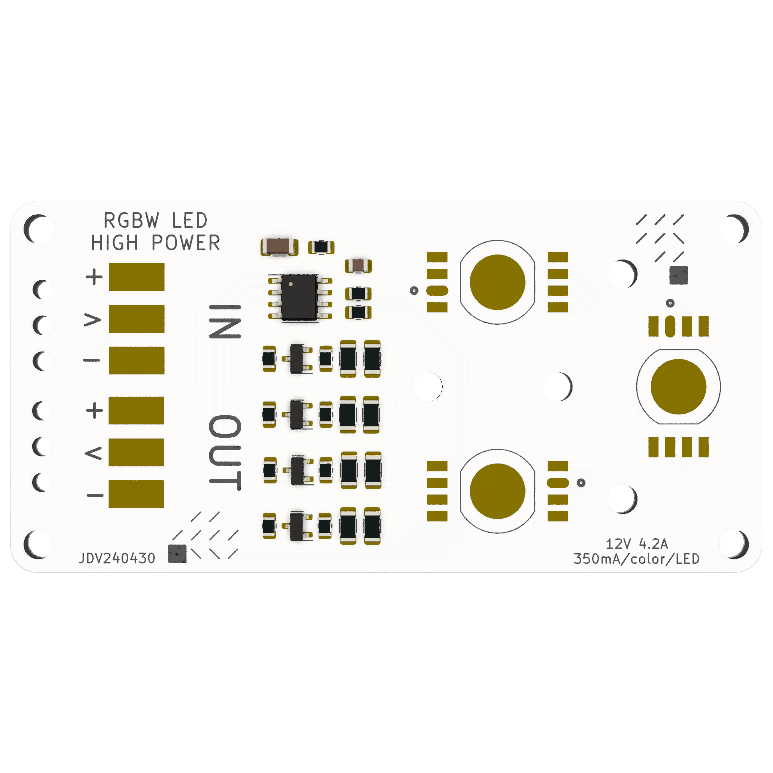
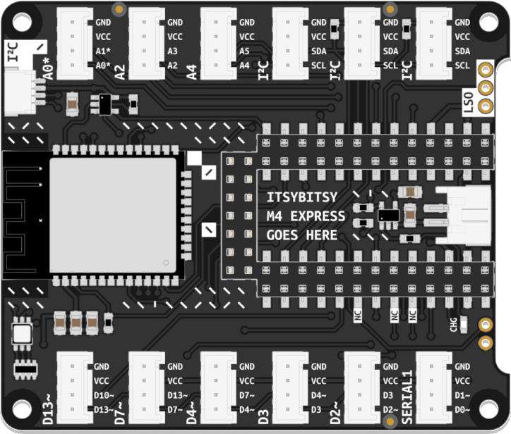
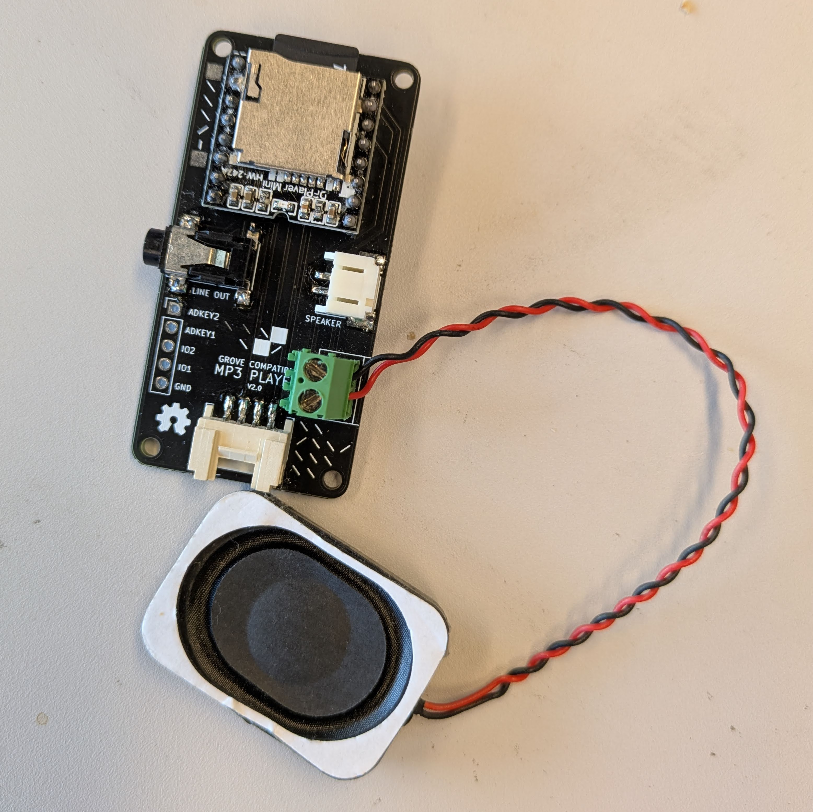
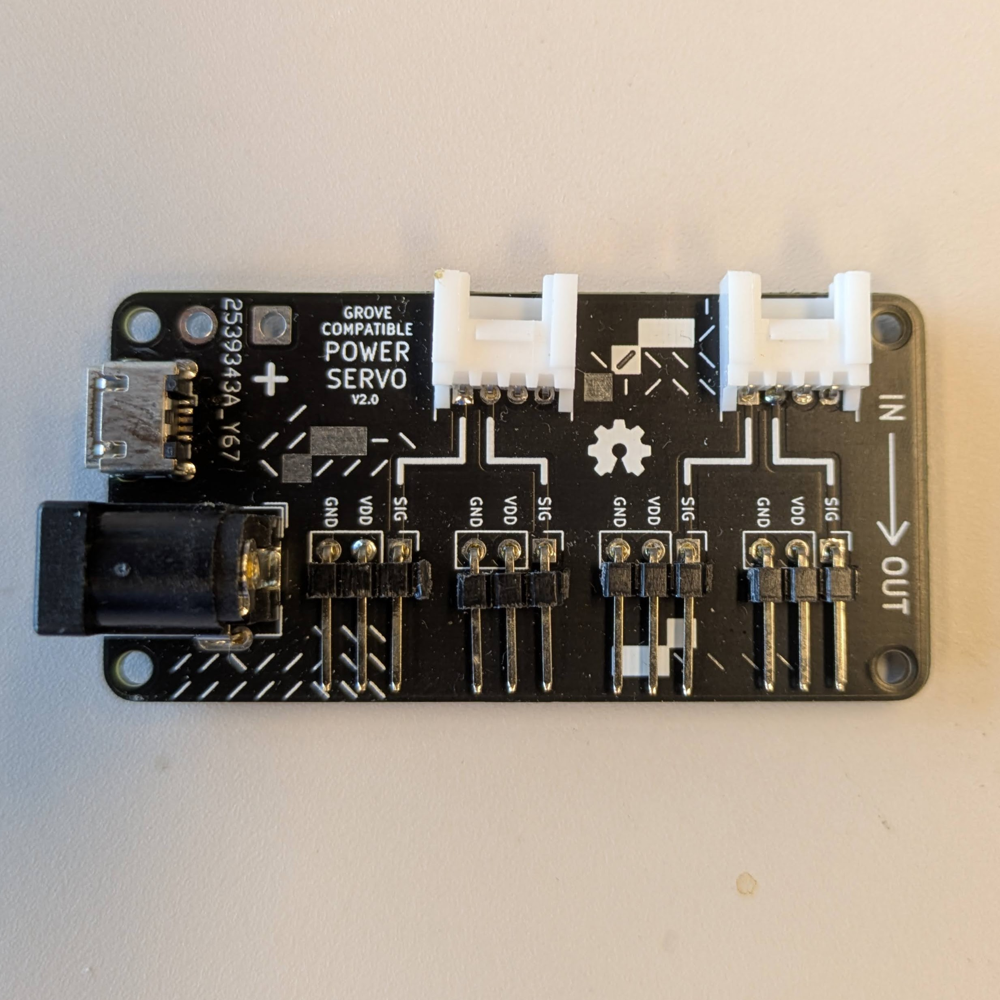
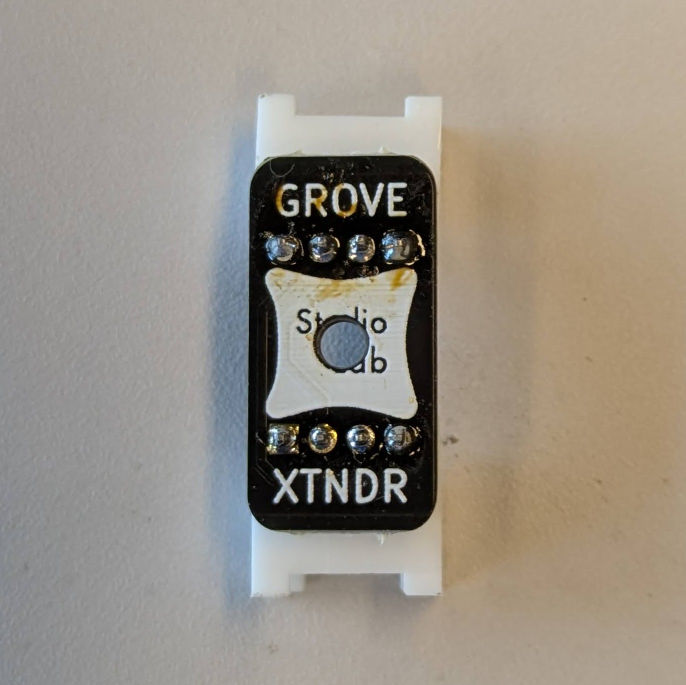
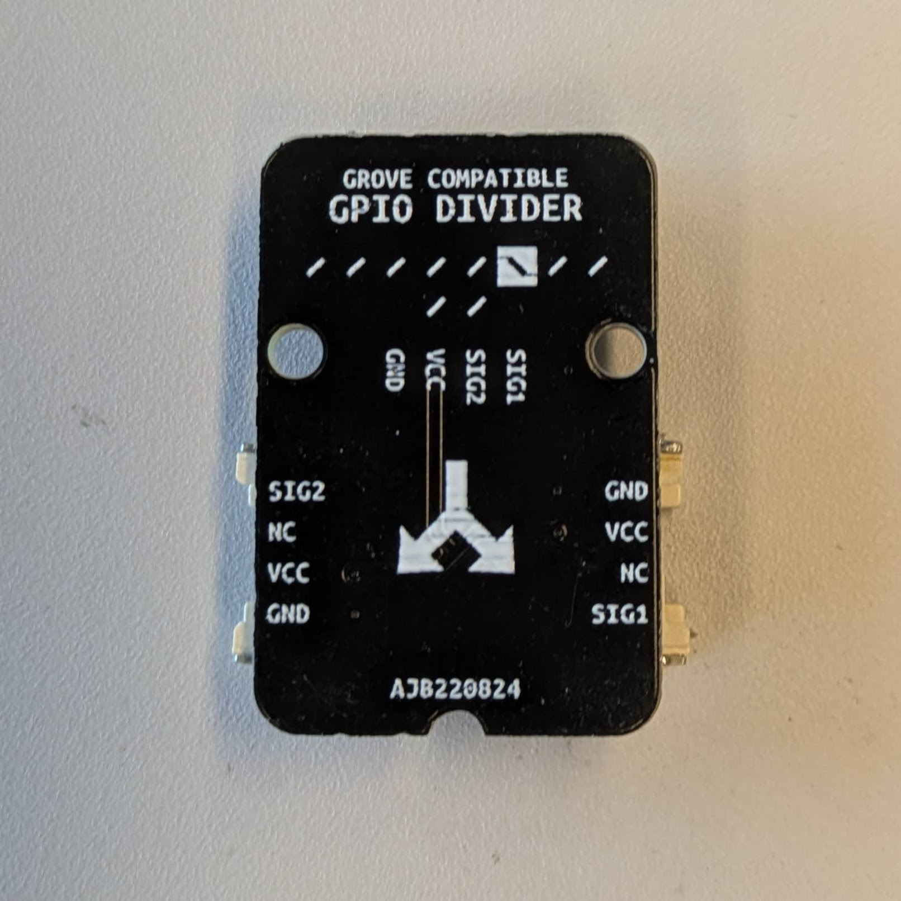
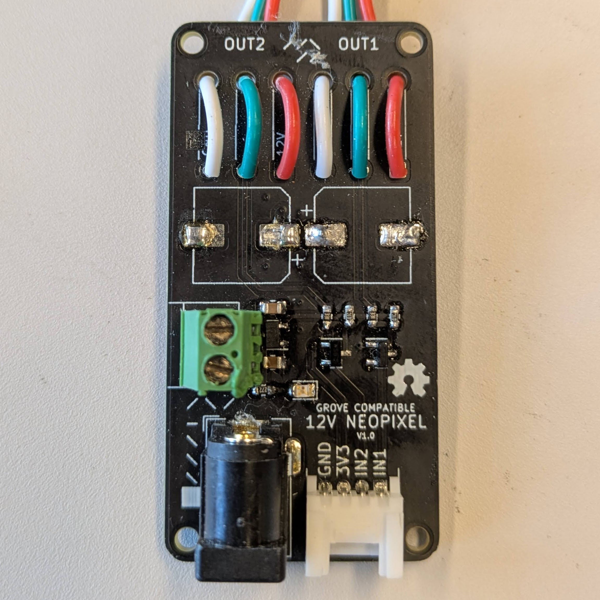

## Advanced Components
Components that are not in the normal kit.

<table>
<thead>
  <tr>
    <th align="center" colspan="2">Radar Sensor</th>
    <th align="center" colspan="1">Motor Driver </th>
    <th align="center">Big chainable LED</th>
    <th align="center">Bluetooth</th>
    <th align="center" colspan="1">MP3 player </th>

  </tr>
</thead>
<tbody>
  <tr>
    <td align="center" colspan="1">Basic Motion</td>
    <td align="center" colspan="1">Advanced Motion</td>
    <td align="center" colspan="1">Motion</td>
    <td align="center">RGB Light</td>
    <td align="center">Communication</td>
    <td align="center" colspan="1">Audio</td>

  </tr>
  <tr>
    <td align="center"></td>
    <td align="center"></td>
    <td align="center"></td>
    <td align="center"></td>
    <td align="center"></td>
    <td align="center"></td>

  </tr>
  <tr>
    <td align="center" colspan="2">
     
    </td>
    <td align="center" colspan="1">
     
    </td>
    <td align="center">
     
    </td>
    <td align="center">
     
     
    </td>
    <td align="center">
     
    </td>
  </tr>
  <tr>
    <td align="center" colspan="1"><a href="basic-radar-sensor/basic-radar-sensor" class="btn btn-blue">Learn More</a></td>
    <td align="center" colspan="1"><a href="advanced-radar-sensor/advanced-radar-sensor" class="btn btn-blue">Learn More</a></td>
    <td align="center" ><a href="motor-driver/motor-driver" class="btn btn-blue">Learn More</a></td>
    <td align="center"><a href="chainable-led-big/chainable-led-big" class="btn btn-blue">Learn More</a></td>
    <td align="center"><a href="bluetooth/bluetooth" class="btn btn-blue">Learn More</a></td>
    <td align="center" ><a href="mp3-player/mp3-player" class="btn btn-blue">Learn More</a></td>

  </tr>
</tbody>
</table>

## Helper Components
Components that can be used to strengthen your kit.

<table>
<thead>
  <tr>
    <th align="center" colspan="2">Power</th>
    <th align="center">Grove Extender</th>
    <th align="center">Grove Splitter</th>
    <th align="center">Neopixel helper</th>

  </tr>
</thead>
<tbody>
  <tr>
    <td align="center" colspan="1">Servo</td>
    <td align="center" colspan="1">PWM</td>
    <td align="center">Other</td>
    <td align="center">Other</td>
    <td align="center">Light</td>

  </tr>
  <tr>
    <td align="center"></td>
    <td align="center"></td>
    <td align="center"></td>
    <td align="center"></td>
    <td align="center"></td>
  </tr>
  <tr>
    <td align="center" colspan="1"><a href="power-servo/power-servo" class="btn btn-blue">Learn More</a></td>
    <td align="center" colspan="1"><a href="power-pwm/power-pwm" class="btn btn-blue">Learn More</a></td>
    <td align="center"><a href="extender/extender" class="btn btn-blue">Learn More</a></td>
    <td align="center"><a href="splitter/splitter" class="btn btn-blue">Learn More</a></td>
    <td align="center"><a href="neopixel/neopixel" class="btn btn-blue">Learn More</a></td>
  </tr>
</tbody>
</table>

## Future Advanced Components
Send us an email to let us know which component to develop first
<table>
<thead>
  <tr>
    <th align="center" colspan="1">Solar power</th>
    <th align="center" colspan="1">BLDC Motor Driver </th>
    <th align="center">CO2 sensor</th>
    <th align="center">IMU</th>
    <th align="center">AC Dimmer</th>
  </tr>
</thead>
<tbody>
  <tr>
    <td align="center" colspan="1">Power</td>
    <td align="center" colspan="1">Motion</td>
    <td align="center" colspan="1">Environmental</td>
    <td align="center">Motion</td>
    <td align="center">Power</td>
  </tr>
  <tr>
    <td align="center"></td>
    <td align="center"></td>
    <td align="center"></td>
    <td align="center"></td>
    <td align="center"></td>
    
  </tr>
  <tr>
    <td align="center"><a href="" class="btn btn-gray">To be developed</a></td>
    <td align="center"><a href="" class="btn btn-gray">To be developed</a></td>
    <td align="center"><a href="" class="btn btn-gray">To be developed</a></td>
    <td align="center"><a href="" class="btn btn-gray">To be developed</a></td>
    <td align="center"><a href="" class="btn btn-gray">To be developed</a></td>
    
  </tr>
</tbody>
</table>

