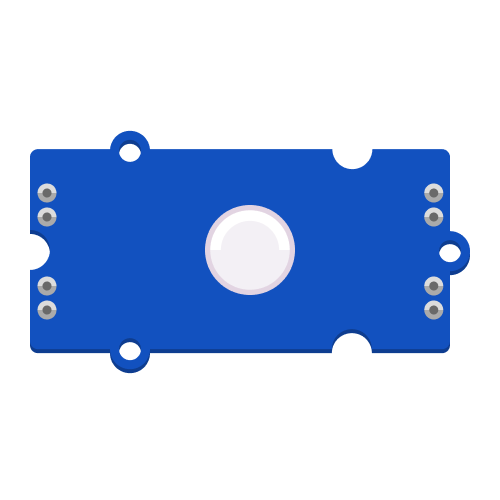
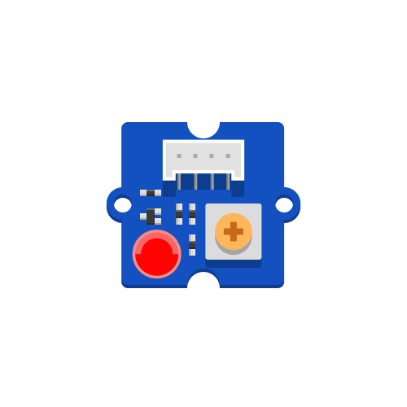
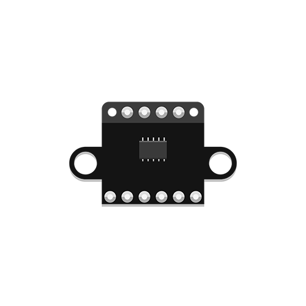

## Archived Components

|                        Chainable RGB LED (Grove)                         |                        LED Pack                        |                        Time of Flight Sensor
                        |
| :----------------------------------------------------------: | :----------------------------------------------------------: |  :----------------------------------------------------------: | 
|                        RGB Light                        |                             Monochrome LED                             |                            Distance                              |
|  |  |  |
|   |   |   |
| [Learn More](chainable-led/chainable-led-p9813){: .btn .btn-blue } | [Learn More](led-pack/led-pack){: .btn .btn-blue } | [Learn More](time-of-flight-distance-sensor/time-of-flight-distance-sensor){: .btn .btn-blue } |

