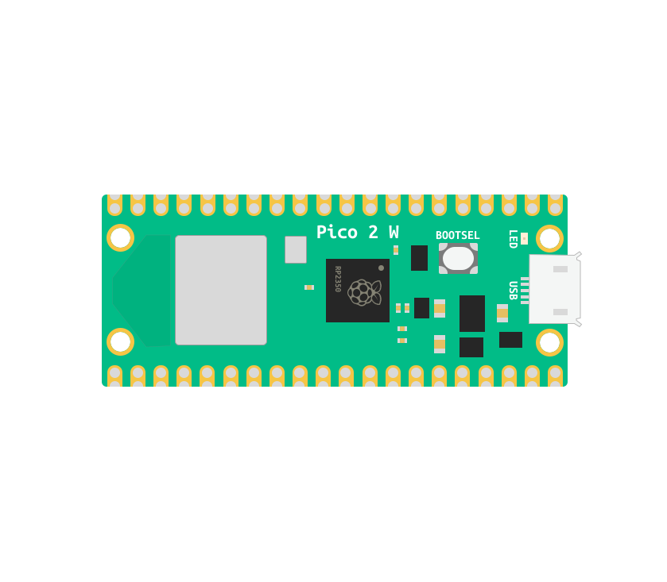
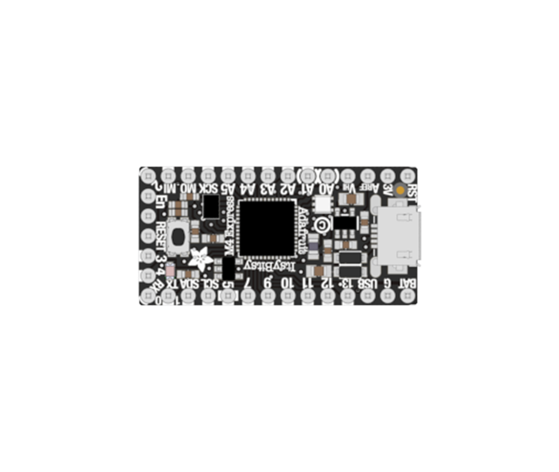
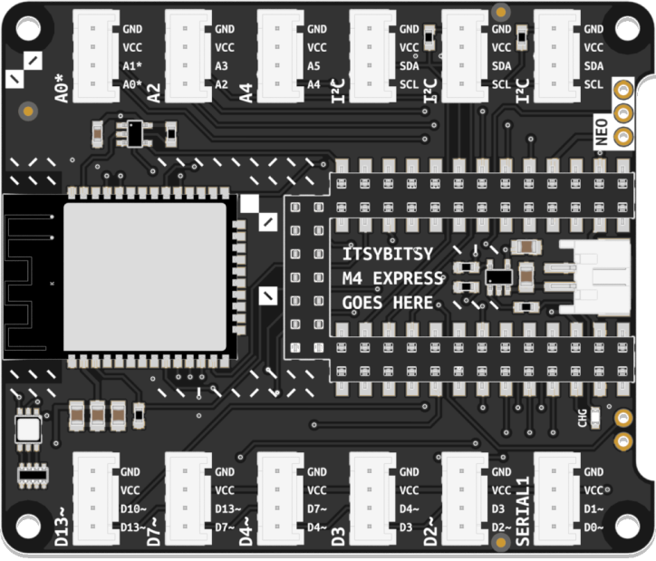
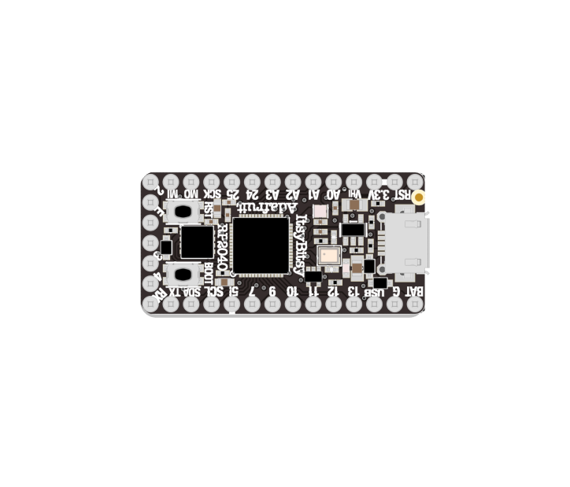
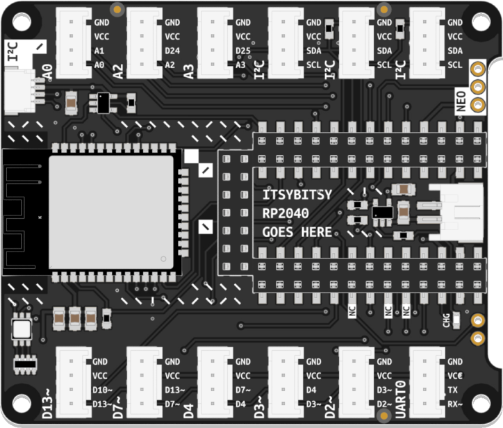

## Core Components

{: .important }
There are **multiple, functionally equivalent editions** of Connected Interaction Kit. The Core Components you own differ slightly between editions. Your exact components are determined by the year in which you purchased your Connected Interaction Kit. This page is designed to help you identify which version you own.

## 2025 Edition

|                       Microcontroller                        |                        Pico Expander                        |
| :----------------------------------------------------------: | :----------------------------------------------------------: |
|                       Pico 2W                       |             Expander Board for Pico              |
|  |  |
|                                                              |                                                              |
| [Learn More](pico-microcontroller/pico){: .btn .btn-blue } | [Learn More](pico-expander/pico-expander){: .btn .btn-blue } |

## 2024 Edition

|                       Microcontroller                        |                        Bitsy Expander                        |
| :----------------------------------------------------------: | :----------------------------------------------------------: |
|                     ItsyBitsy M4 Express                     |           Expander Board for ItsyBitsy M4 Express            |
|  |  |
|                                                              |                                                              |
| [Learn More](itsybitsy-microcontroller/itsybitsy-m4-express){: .btn .btn-blue } | [Learn More](bitsy-expander/bitsy-expander-m4){: .btn .btn-blue } |
  
## 2023 Edition

|                       Microcontroller                        |                        Bitsy Expander                        |
| :----------------------------------------------------------: | :----------------------------------------------------------: |
|                       ItsyBitsy RP2040                       |             Expander Board for ItsyBitsy RP2040              |
|  |  |
|                                                              |                                                              |
| [Learn More](itsybitsy-microcontroller/itsybitsy-rp2040){: .btn .btn-blue } | [Learn More](bitsy-expander/bitsy-expander-rp2040){: .btn .btn-blue } |

## 2022 Edition

|                       Microcontroller                        |                        Bitsy Expander                        |
| :----------------------------------------------------------: | :----------------------------------------------------------: |
|                     ItsyBitsy M4 Express                     |           Expander Board for ItsyBitsy M4 Express            |
|  |  |
|                                                              |                                                              |
| [Learn More](itsybitsy-microcontroller/itsybitsy-m4-express){: .btn .btn-blue } | [Learn More](bitsy-expander/bitsy-expander-m4){: .btn .btn-blue } |
