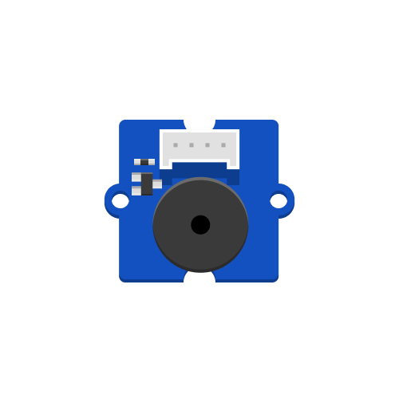
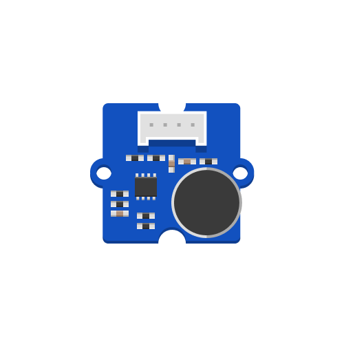
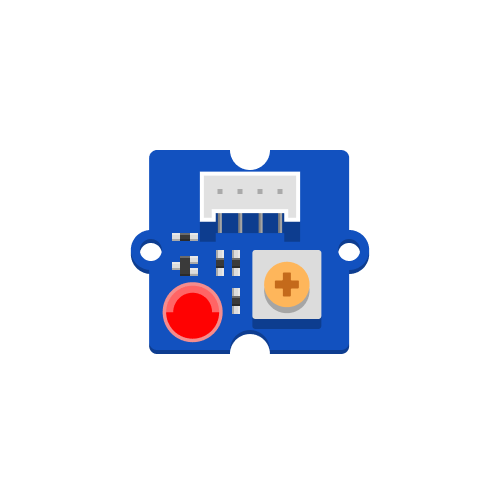

## Solderless Grove Components

|                         Touch Sensor                         |                       Vibration Motor                        |                         Piezo Buzzer                         |                         Sound Sensor                         |                         Servo Motor                          |
| :----------------------------------------------------------: | :----------------------------------------------------------: | :----------------------------------------------------------: | :----------------------------------------------------------: | :----------------------------------------------------------: |
|                       Capacitive Touch                       |                       Haptics & Touch                        |                            Sound                             |                            Sound                             |                            Motion                            |
|   |  |   |   |            |
|   |   |   |   |   |
|  [Learn More](touch-sensor/touch-sensor){: .btn .btn-blue }  | [Learn More](vibration-motor/vibration-motor){: .btn .btn-blue } |  [Learn More](piezo-buzzer/piezo-buzzer){: .btn .btn-blue }  |  [Learn More](sound-sensor/sound-sensor){: .btn .btn-blue }  |   [Learn More](servo-motor/servo-motor){: .btn .btn-blue }   |

<table>
<thead>
  <tr>
    <th align="center" colspan="2">Time of Flight Sensor </th>
    <th align="center" colspan="2">Chainable LED</th>
    <th align="center">LED Pack</th>
  </tr>
</thead>
<tbody>
  <tr>
    <td align="center" colspan="2">Distance</td>
    <td align="center">RGB/W Light</td>
    <td align="center">RGB Light</td>
    <td align="center">Monochrome LED</td>
  </tr>
  <tr>
    <td align="center"></td>
    <td align="center"></td>
    <td align="center"></td>
    <td align="center"></td>
    <td align="center"></td>
  </tr>
  <tr>
    <td align="center" colspan="2"> </td>
    <td align="center" colspan="2"> </td>
    <td align="center"> </td>
  </tr>
  <tr>
    <td align="center" colspan="2"><a href="time-of-flight-distance-sensor/time-of-flight-distance-sensor" class="btn btn-blue">Learn More</a></td>
    <td align="center"><a href="chainable-led/chainable-led-chaineo" class="btn btn-blue">Learn More</a></td>
    <td align="center"><a href="chainable-led/chainable-led-p9813" class="btn btn-blue">Learn More</a></td>
    <td align="center"><a href="led-pack/led-pack" class="btn btn-blue">Learn More</a></td>
  </tr>
</tbody>
</table>

