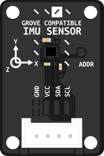

## Solderless Grove Components

|                         Touch Sensor                         |                       Vibration Motor                        |                         Piezo Buzzer                         |                         Sound Sensor                         |
| :----------------------------------------------------------: | :----------------------------------------------------------: | :----------------------------------------------------------: | :----------------------------------------------------------: | :----------------------------------------------------------: |
|                       Capacitive Touch                       |                       Haptics & Touch                        |                            Sound                             |                            Sound                             |
|   |  |   |   |
|   |   |   |   |
|  [Learn More](touch-sensor/touch-sensor){: .btn .btn-blue }  | [Learn More](vibration-motor/vibration-motor){: .btn .btn-blue } |  [Learn More](piezo-buzzer/piezo-buzzer){: .btn .btn-blue }  |  [Learn More](sound-sensor/sound-sensor){: .btn .btn-blue }  |

| Time of Flight Sensor | Chainable LED | Servo motor | IMU sensor |
| :---: | :---: | :---: | :---: |
| Distance | RGB/W Light | Motion | Motion |
|  |  |  |  |
|   |   |   |   |
| [Learn More](time-of-flight-distance-sensor/time-of-flight-distance-sensor){: .btn .btn-blue } | [Learn More](chainable-led/chainable-led-chaineo){: .btn .btn-blue } | [Learn More](servo-motor/servo-motor){: .btn .btn-blue } | [Learn More](imu-sensor/imu-sensor){: .btn .btn-blue } |