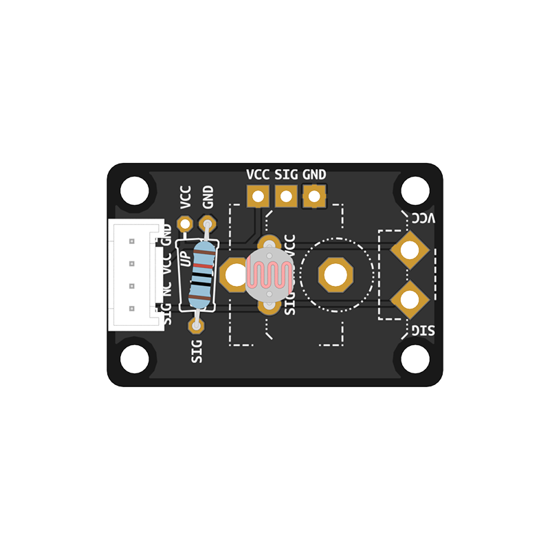

# Components

 The core of the Connected Interaction Kit is an ItsyBitsy microcontroller board. With the help of a bit of code, this microcontroller allows you to interact with and perceive the outside world using various electronic sensors and actuators.

In addition, the kit contains the BitsyExpander, a board that allows you to easily build prototypes without the need for soldering. Later on, it can also enable you to make use of Wifi or Bluetooth, as well as to power your project from a battery.

## Core Components

|                       Microcontroller                        |                        Bitsy Expander                        |
| :----------------------------------------------------------: | :----------------------------------------------------------: |
|                ItsyBitsy RP2040 or M4 Express                |           Solderless Connector Board for ItsyBitsy           |
|  |  |
| [Learn More](itsybitsy-microcontroller/itsybitsy){: .btn .btn-blue } | [Learn More](bitsy-expander/bitsy-expander){: .btn .btn-blue } |

## Sensors & Actuators

Beyond that, the kit offers a selection of sensors and actuators. There are solderless components you can use right away, as well as custom components that require you to assemble them first. 

*Some components listed below may not be part of your kit edition but are available separately.*

### Solderless Grove Components

|                         Touch Sensor                         |                       Vibration Motor                        |                         Piezo Buzzer                         |                         Sound Sensor                         |                         Servo Motor                          |
| :----------------------------------------------------------: | :----------------------------------------------------------: | :----------------------------------------------------------: | :----------------------------------------------------------: | :----------------------------------------------------------: |
|                       Capacitive Touch                       |                       Haptics & Touch                        |                            Sound                             |                            Sound                             |                            Motion                            |
|   |  |   |   |            |
|   |   |   |   |   |
|  [Learn More](touch-sensor/touch-sensor){: .btn .btn-blue }  | [Learn More](vibration-motor/vibration-motor){: .btn .btn-blue } |  [Learn More](piezo-buzzer/piezo-buzzer){: .btn .btn-blue }  |  [Learn More](sound-sensor/sound-sensor){: .btn .btn-blue }  |   [Learn More](servo-motor/servo-motor){: .btn .btn-blue }   |

### Solderless Grove Components

<table>
<thead>
  <tr>
    <th align="center" colspan="2">Time of Flight Sensor </th>
    <th align="center" colspan="2">Chainable LED</th>
    <th align="center">LED Pack</th>
  </tr>
</thead>
<tbody>
  <tr>
    <td align="center" colspan="2">Distance</td>
    <td align="center">RGB/W Light</td>
    <td align="center">RGB Light</td>
    <td align="center">Monochrome LED</td>
  </tr>
  <tr>
    <td align="center"></td>
    <td align="center"></td>
    <td align="center"></td>
    <td align="center"></td>
    <td align="center"></td>
  </tr>
  <tr>
    <td align="center" colspan="2"> </td>
    <td align="center" colspan="2"> </td>
    <td align="center"> </td>
  </tr>
  <tr>
    <td align="center" colspan="2"><a href="time-of-flight-distance-sensor/time-of-flight-distance-sensor" class="btn btn-blue">Learn More</a></td>
    <td align="center"><a href="chainable-led/chainable-led-chaineo" class="btn btn-blue">Learn More</a></td>
    <td align="center"><a href="chainable-led/chainable-led-p9813" class="btn btn-blue">Learn More</a></td>
    <td align="center"><a href="led-pack/led-pack" class="btn btn-blue">Learn More</a></td>
  </tr>
</tbody>
</table>

### Custom Components

|                        Potentiometer                         |                        Tactile Switch                        |                         Tilt Switch                          |                          Thermistor                          |                        Photoresistor                         |
| :----------------------------------------------------------: | :----------------------------------------------------------: | :----------------------------------------------------------: | :----------------------------------------------------------: | :----------------------------------------------------------: |
|                        Position/Angle                        |                             Push                             |                             Tilt                             |                         Temperature                          |                          Brightness                          |
|  |  |  |  |  |
|   |   |   |   |   |
| [Learn More](rotary-potentiometer/rotary-potentiometer){: .btn .btn-blue } | [Learn More](tactile-switch/tactile-switch){: .btn .btn-blue } |   [Learn More](tilt-switch/tilt-switch){: .btn .btn-blue }   |    [Learn More](thermistor/thermistor){: .btn .btn-blue }    | [Learn More](photoresistor/photoresistor){: .btn .btn-blue } |

