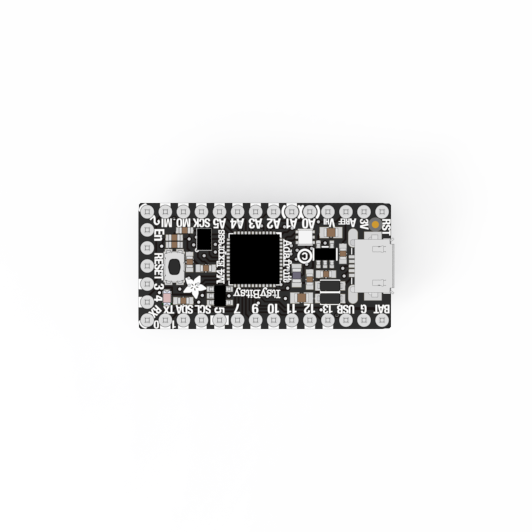
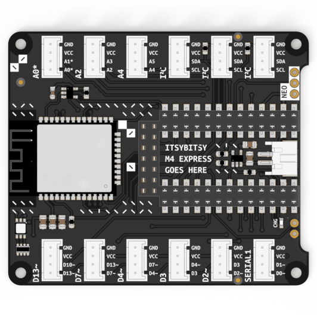
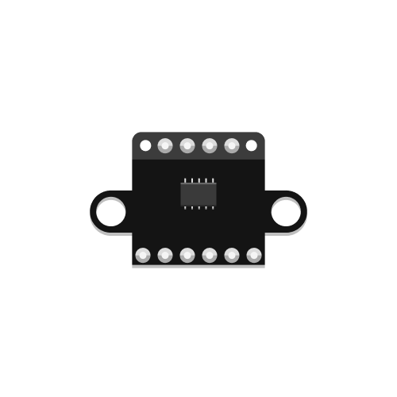

# Components

The kit's centerpiece is the ItsyBitsy M4 Express microcontroller board. With the help of a bit of code, a microcontroller allows you to interface with various electronic sensors and actuators to sense and interact with the environment.

In addition, the kit contains the BitsyExpander, a board that allows you to easily build simple prototypes without the need for soldering. Later on, it can also enable you to make use of Wifi or Bluetooth, as well as to power your project from a battery.

## Core Components

|                       Microcontroller                        |                        BitsyExpander                         |
| :----------------------------------------------------------: | :----------------------------------------------------------: |
|                     ItsyBitsy M4 Express                     |                Allows solderless connections                 |
|  |  |

## Sensors & Actuators

Beyond that, the kit offers a selecton of sensors and actuators. There are seven solderless components you can use right away, as well as five components for you to assemble yourself:

### Solderless Grove Components (Output)

|                      LED Pack                      |                        Chainable LED                         |                       Vibration Motor                        |                        Piezo Buzzer                         |                 Servo Motor                  |
| :------------------------------------------------: | :----------------------------------------------------------: | :----------------------------------------------------------: | :---------------------------------------------------------: | :------------------------------------------: |
|                   Monochrome LED                   |                           RGB LED                            |                       Haptics & Touch                        |                            Sound                            |                    Motion                    |
|     |  |  |  |  |
| [Learn More](led-pack/led-pack){: .btn .btn-blue } | [Learn More](chainable-rgb-led/chainable-rgb-led){: .btn .btn-blue } | [Learn More](vibration-motor/vibration-motor){: .btn .btn-blue } | [Learn More](piezo-buzzer/piezo-buzzer){: .btn .btn-blue }  | [Learn More](servo/servo){: .btn .btn-blue } |

### Solderless Grove Components (Input)

|                         Touch Sensor                         |                    Time-of-Flight Sensor                     |
| :----------------------------------------------------------: | :----------------------------------------------------------: |
|                       Capacitive Touch                       |                           Distance                           |
|  |  |
|  [Learn More](touch-sensor/touch-sensor){: .btn .btn-blue }  | [Learn More](time-of-flight-distance-sensor/time-of-flight-distance-sensor){: .btn .btn-blue } |

### Custom Components Requiring Assembly (Input)

|                        Potentiometer                         |                        Tactile Switch                        |                        Tilt Switch                        |                          Thermistor                          |                        Photoresistor                         |
| :----------------------------------------------------------: | :----------------------------------------------------------: | :-------------------------------------------------------: | :----------------------------------------------------------: | :----------------------------------------------------------: |
|                        Position/Angle                        |                             Push                             |                           Tilt                            |                         Temperature                          |                          Brightness                          |
|  |  |  |  |  |
| [Learn More](rotation-potentiometer/rotation-potentiometer){: .btn .btn-blue } | [Learn More](tactile-switch/tactile-switch){: .btn .btn-blue } | [Learn More](tilt-switch/tilt-switch){: .btn .btn-blue }  | [Learn More](temperature-sensor/temperature-sensor){: .btn .btn-blue } | [Learn More](photo-resistor/photo-resistor){: .btn .btn-blue } |

