# Components

 The core of the Connected Interaction Kit is an ItsyBitsy microcontroller board. With the help of a bit of code, this microcontroller allows you to interact with and perceive the outside world using various electronic sensors and actuators.

In addition, the kit contains the BitsyExpander, a board that allows you to easily build prototypes without the need for soldering. Later on, it can also enable you to make use of Wifi or Bluetooth, as well as to power your project from a battery.

## Core Components

|                       Microcontroller                        |                        Expander                        |
| :----------------------------------------------------------: | :----------------------------------------------------------: |
|                Pico 2W                |           Solderless Connector Board for Pico           |
| 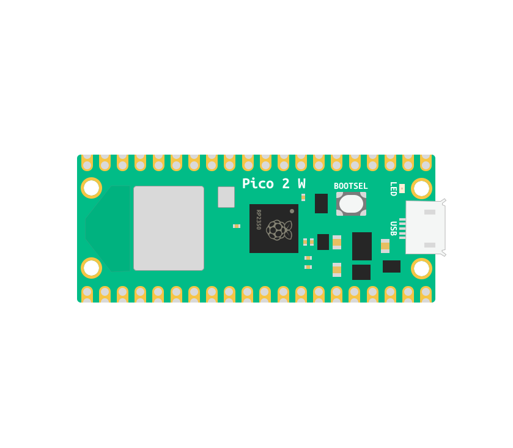 |  |
| [Learn More](pico-microcontroller/pico){: .btn .btn-blue } | [Learn More](pico-expander/pico-expander){: .btn .btn-blue } |

{: .important }
There are **multiple, functionally equivalent editions** of Connected Interaction Kit. The Core Components you own differ slightly between editions. Your exact components are determined by the year in which you purchased your Connected Interaction Kit. This page is designed to help you identify which version you own.

If in doubt, jump to the bottom of the page for helpful pointers on how to [recognize your hardware](components-core).

## Sensors & Actuators

Beyond that, the kit offers a selection of sensors and actuators. There are solderless components you can use right away, as well as custom components that require you to assemble them first. 

*Some components listed below may not be part of your kit edition but are available separately.*

### Solderless Grove Components

|                         Touch Sensor                         |                       Vibration Motor                        |                         Piezo Buzzer                         |                         Sound Sensor                         |
| :----------------------------------------------------------: | :----------------------------------------------------------: | :----------------------------------------------------------: | :----------------------------------------------------------: | :----------------------------------------------------------: |
|                       Capacitive Touch                       |                       Haptics & Touch                        |                            Sound                             |                            Sound                             |
| 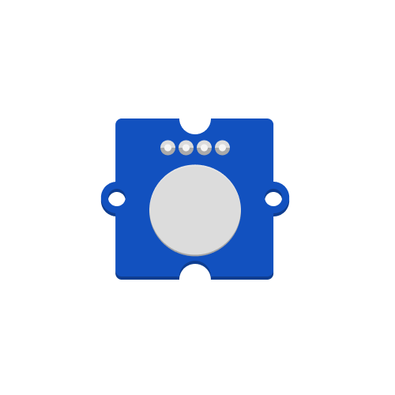  | 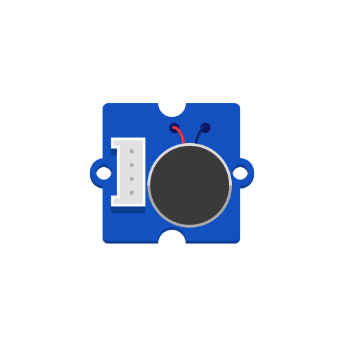 | 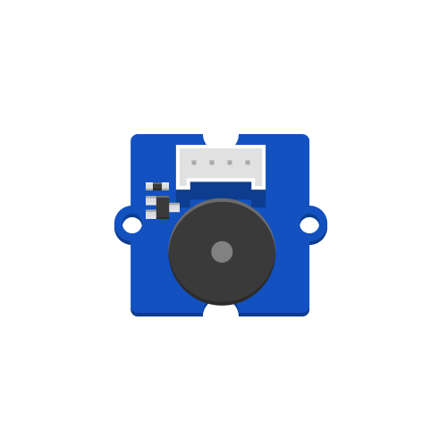  | 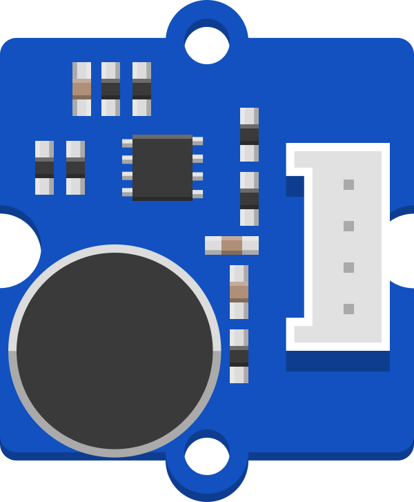  |
|   |   |   |   |
|  [Learn More](touch-sensor/touch-sensor){: .btn .btn-blue }  | [Learn More](vibration-motor/vibration-motor){: .btn .btn-blue } |  [Learn More](piezo-buzzer/piezo-buzzer){: .btn .btn-blue }  |  [Learn More](sound-sensor/sound-sensor){: .btn .btn-blue }  |

<table>
<thead>
  <tr>
    <th align="center" colspan="1">Time of Flight Sensor </th>
    <th align="center" colspan="1">Chainable LED</th>
    <th align="center" colspan="1">Servo motor</th>
  </tr>
</thead>
<tbody>
  <tr>
    <td align="center" colspan="1">Distance</td>
    <td align="center">RGB/W Light</td>
    <td align="center">Motion</td>
  </tr>
  <tr>
    <td align="center">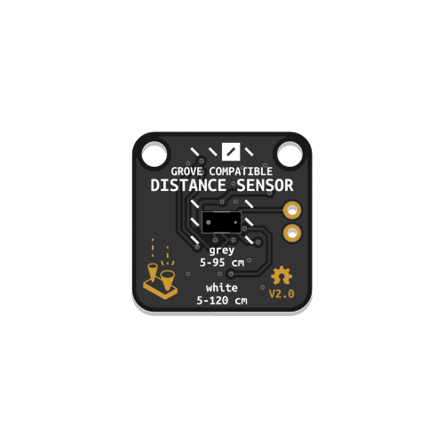</td>
    <td align="center">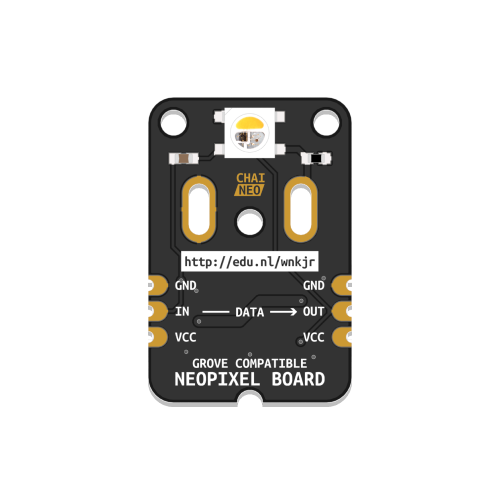</td>
    <td align="center">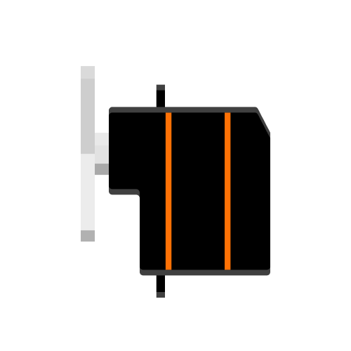</td>
  </tr>
  <tr>
    <td align="center" colspan="1"> </td>
    <td align="center" colspan="1"> </td>
    <td align="center" colspan="1"> </td>
  </tr>
  <tr>
    <td align="center" colspan="1"><a href="time-of-flight-distance-sensor/time-of-flight-distance-sensor" class="btn btn-blue">Learn More</a></td>
    <td align="center"><a href="chainable-led/chainable-led-chaineo" class="btn btn-blue">Learn More</a></td>
    <td align="center"><a href="servo-motor/servo-motor" class="btn btn-blue">Learn More</a></td>
  </tr>
</tbody>
</table>

### Custom Components

|                        Potentiometer                         |                        Tactile Switch                        |                         Tilt Switch                          |                          Thermistor                          |                        Photoresistor                         |
| :----------------------------------------------------------: | :----------------------------------------------------------: | :----------------------------------------------------------: | :----------------------------------------------------------: | :----------------------------------------------------------: |
|                        Position/Angle                        |                             Push                             |                             Tilt                             |                         Temperature                          |                          Brightness                          |
| 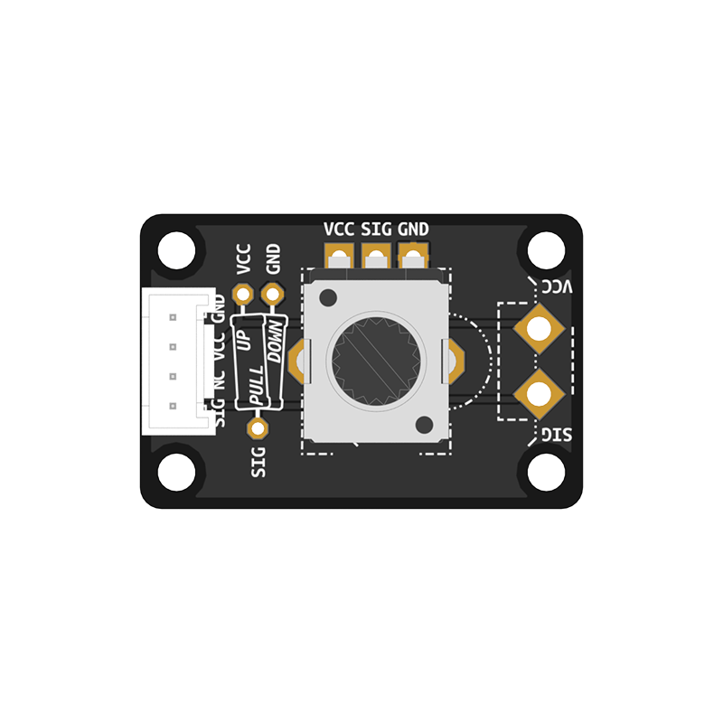 | 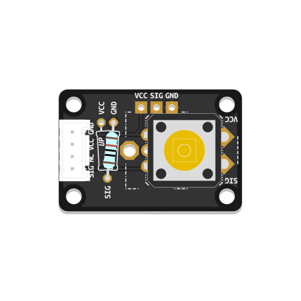 | 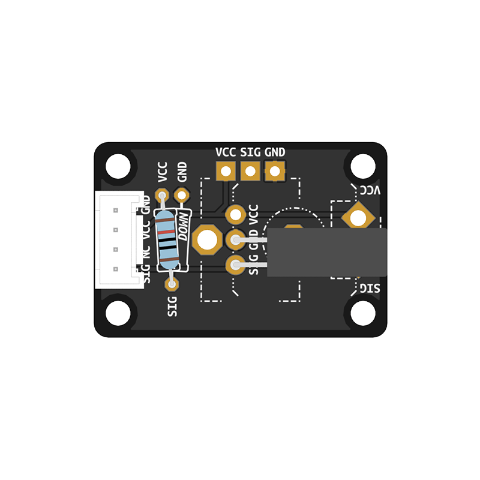 | 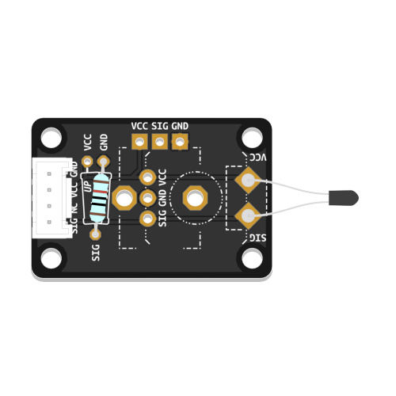 | 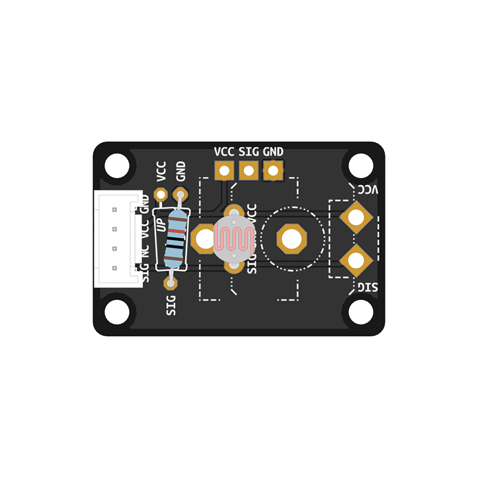 |
|   |   |   |   |   |
| [Learn More](rotary-potentiometer/rotary-potentiometer){: .btn .btn-blue } | [Learn More](tactile-switch/tactile-switch){: .btn .btn-blue } |   [Learn More](tilt-switch/tilt-switch){: .btn .btn-blue }   |    [Learn More](thermistor/thermistor){: .btn .btn-blue }    | [Learn More](photoresistor/photoresistor){: .btn .btn-blue } |

