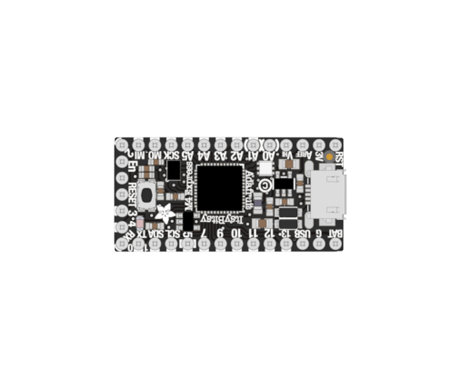

# ItsyBitsy Microcontroller
The micro controller at the heart of you projects, it reads inputs, processes data and controls the outputs.

More detailed component information can be found [here](https://www.adafruit.com/product/3800).

---

Documentation coming soon
{: .label .label-yellow }

