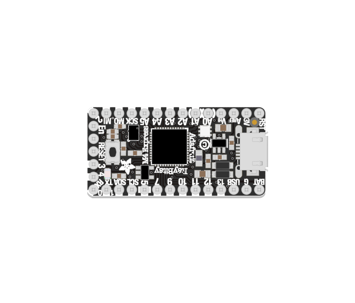

# ItsyBitsy Development Board

The central component at the heart of your projects. It runs code, reads and processes sensor data, and controls outputs (lights, motors, speakers, etc.) 

---

Your kit includes one of **two functionally equivalent ItsyBitsy Development Boards**, depending on the edition of your Connected Interaction Kit. This page is designed to help you identify which version you own.

|                         2022 Edition                         |                         2023 Edition                         |
| :----------------------------------------------------------: | :----------------------------------------------------------: |
|                     ItsyBitsy M4 Express                     |                       ItsyBitsy RP2040                       |
|  |  |
|    [Learn More](itsybitsy-m4-express){: .btn .btn-blue }     |      [Learn More](itsybitsy-rp2040){: .btn .btn-blue }       |

### Which ItsyBitsy Development Board do I have?

  
  

The **ItsyBitsy M4 Express** features **one (RESET) button**.
The **ItsyBitsy RP2040** features **two (BOOT, RESET) buttons**.
