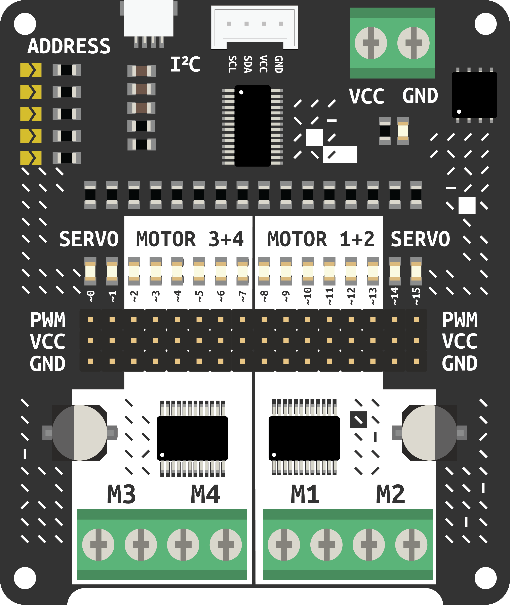

# Motor Driver
<a href="../../glossary/glossary"></a> <a href="../../glossary/glossary"></a>

< one sentence explaination of item >


---

## Required Libraries
link to library

## Basic Usage

### Example LED

This goes through all LEDs on the board and fades them in and out one by one.
(from [adafruit](https://learn.adafruit.com/16-channel-pwm-servo-driver/python-circuitpython))
 
```python
# SPDX-FileCopyrightText: 2021 ladyada for Adafruit Industries
# SPDX-License-Identifier: MIT

import time
import board
from adafruit_pca9685 import PCA9685

# Create the I2C bus interface.
i2c = board.I2C()  # uses board.SCL and board.SDA
# i2c = busio.I2C(board.GP1, board.GP0)    # Pi Pico RP2040

# Create a simple PCA9685 class instance.
pca = PCA9685(i2c, address=0x60)

# Set the PWM frequency to 60hz.
pca.frequency = 60

def fade_led_in(channel, steps=100, delay=0.0001):
    for i in range(steps):
        # Calculate the duty cycle value (0 to 0xFFFF)
        duty_cycle = int(0xFFFF * (i / steps))
        pca.channels[channel].duty_cycle = duty_cycle
        time.sleep(delay)

def fade_led_out(channel, steps=100, delay=0.0001):
    for i in range(steps):
        # Calculate the duty cycle value (0 to 0xFFFF)
        duty_cycle = int(0xFFFF * ((steps - i) / steps))
        pca.channels[channel].duty_cycle = duty_cycle
        time.sleep(delay)
    # Ensure the LED is fully off at the end
    pca.channels[channel].duty_cycle = 0x0000

# Light up each LED one by one with a fade effect and then turn them off
while True:
    for channel in range(16):
        fade_led_in(channel)
        time.sleep(0.1)  # Optional: wait half a second after fading in
        fade_led_out(channel)
        time.sleep(0.1)  # Optional: wait half a second after fading out

```

### Example Servo

(from [adafruit](https://learn.adafruit.com/16-channel-pwm-servo-driver/python-circuitpython))
```python
# SPDX-FileCopyrightText: 2021 ladyada for Adafruit Industries
# SPDX-License-Identifier: MIT

"""Simple test for a standard servo on channel 0 and a continuous rotation servo on channel 1."""
import time
from adafruit_servokit import ServoKit

# Set channels to the number of servo channels on your kit.
# 8 for FeatherWing, 16 for Shield/HAT/Bonnet.
kit = ServoKit(channels=16, address=0x60)

kit.servo[0].angle = 180
time.sleep(1)
kit.servo[0].angle = 0
time.sleep(1)
```

### Example DC motor

turn motor 1 full throttle forward
(from [adafruit](https://learn.adafruit.com/adafruit-motor-shield-v2-for-arduino/python-circuitpython))
```python
# SPDX-FileCopyrightText: 2021 ladyada for Adafruit Industries
# SPDX-License-Identifier: MIT

"""Simple test for using adafruit_motorkit with a DC motor"""
import time
import board
from adafruit_motorkit import MotorKit

kit = MotorKit(i2c=board.I2C())
while True:
    kit.motor1.throttle = 1.0
    time.sleep(1)
    kit.motor1.throttle = 0
    time.sleep(1)
    kit.motor1.throttle = -1.0
    time.sleep(1)
    kit.motor1.throttle = 0
    time.sleep(1)
```
### Example Stepper motor

turn 100 steps with a stepper motor
(from [adafruit](https://learn.adafruit.com/adafruit-motor-shield-v2-for-arduino/python-circuitpython))

```python
# SPDX-FileCopyrightText: 2021 ladyada for Adafruit Industries
# SPDX-License-Identifier: MIT

"""Simple test for using adafruit_motorkit with a stepper motor"""
import time
import board
from adafruit_motorkit import MotorKit

kit = MotorKit(i2c=board.I2C())

for i in range(100):
    kit.stepper1.onestep()
    time.sleep(0.01)
```
