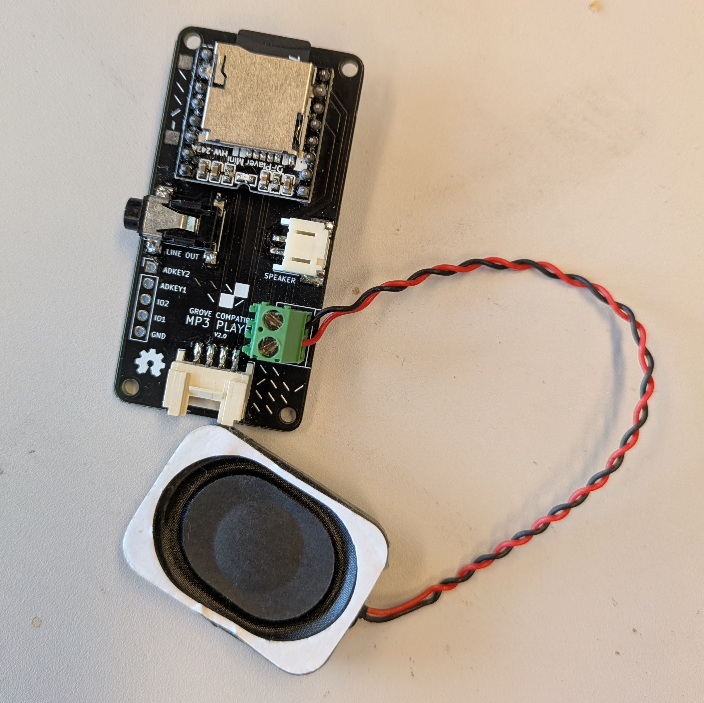

# MP3 player
<a href="../../glossary/glossary"></a> <a href="../../glossary/glossary"></a>

A grove compatible MP3 player module controllable over serial

---

## Required Libraries
link to library  
<button onclick="downloadDFPlayer()">Download DFPlayer.py</button>

<script>
function downloadDFPlayer() {
    const fileUrl = 'https://raw.githubusercontent.com/id-studiolab/DFPlayer/main/lib/DFPlayer.py';
    fetch(fileUrl).then(response => response.blob()).then(blob => {
        const url = window.URL.createObjectURL(blob);
        const a = document.createElement('a');
        a.style.display = 'none';
        a.href = url;
        a.download = 'DFPlayer.py';
        document.body.appendChild(a);
        a.click();
        window.URL.revokeObjectURL(url);
        document.body.removeChild(a);
    }).catch(err => console.error('Download failed:', err));
}
</script>

## Basic Usage
 
```python
import board
import busio
import digitalio
import time
from DFPlayer import DFPlayer

# Configuration
# Adjust pins for your specific board
UART_TX = board.GP0
UART_RX = board.GP1
BUTTON_PIN = board.GP15

# Setup UART
uart = busio.UART(UART_TX, UART_RX, baudrate=9600, timeout=0.1)

# Setup Button
button = digitalio.DigitalInOut(BUTTON_PIN)
button.direction = digitalio.Direction.INPUT
button.pull = digitalio.Pull.UP

# Initialize DFPlayer
df = DFPlayer(uart, debug=False, volume=10, command_delay=0.1)

print("Simple DFPlayer Example")
print("Press button to go to next song")

df.play_track(1) # Start with first track

last_button_state = True
while True:
    current_button_state = button.value
    
    if not current_button_state and last_button_state:
        print("Button pressed! Next song...")
        df.next()
        
    last_button_state = current_button_state
    time.sleep(0.05)
```
## Further readings
[DFPlayer_Mini_SKU_DFR0299-DFRobot](https://wiki.dfrobot.com/DFPlayer_Mini_SKU_DFR0299)  
[Datasheet](https://www.farnell.com/datasheets/3161923.pdf)