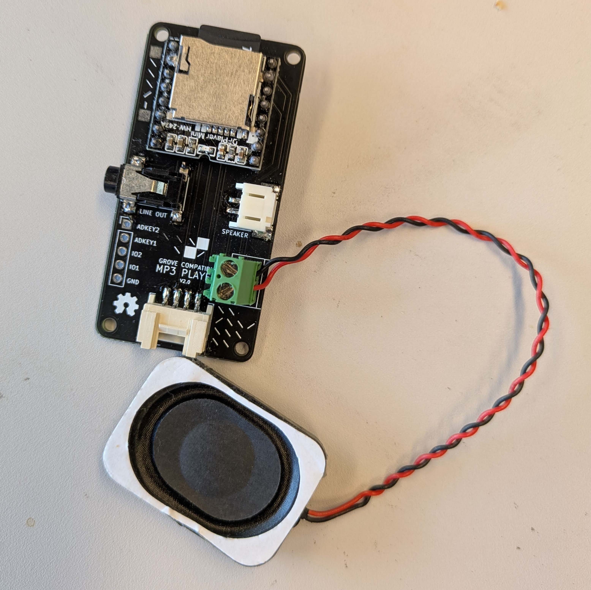

# MP3 player
<a href="../../glossary/glossary"></a> <a href="../../glossary/glossary"></a>

A grove compatible MP3 player module controllable over serial

---

## Required Libraries
link to library [DFPlayer.py](assets/DFPlayer.py)

## Basic Usage
 
```python

import time
import board
from DFPlayer import DFPlayer
from digitalio import DigitalInOut, Direction, Pull

led = DigitalInOut(board.LED)
led.direction = Direction.OUTPUT
# --- constants   ----------------------------------------------------------

switch = DigitalInOut(board.D2)
switch.direction = Direction.INPUT
switch.pull = Pull.UP

PLAYER_VOL   = 80
# PLAYER_RX  = board.RX   # board.D3
# PLAYER_TX  = board.TX   # board.D4

# --- objects   -----------------------------------------------------------

dfplayer = DFPlayer(volume=PLAYER_VOL)              # creates uart internally

active = True

dfplayer.play()
time.sleep(0.200)

# --- main loop   --------------------------------------------------------

while True:
  if active:
   
    if dfplayer.get_status() != DFPlayer.STATUS_BUSY:
      print("switching to next song")
      dfplayer.next()
  # We could also do "led.value = not switch.value"!
  if switch.value:
      dfplayer.stop()
  else:
      led.value = True

  

  time.sleep(0.1)# Write your code here :-)
# Write your code here :-)
```
## Further readings
[DFPlayer_Mini_SKU_DFR0299-DFRobot](https://wiki.dfrobot.com/DFPlayer_Mini_SKU_DFR0299)  
[Datasheet](https://www.farnell.com/datasheets/3161923.pdf)