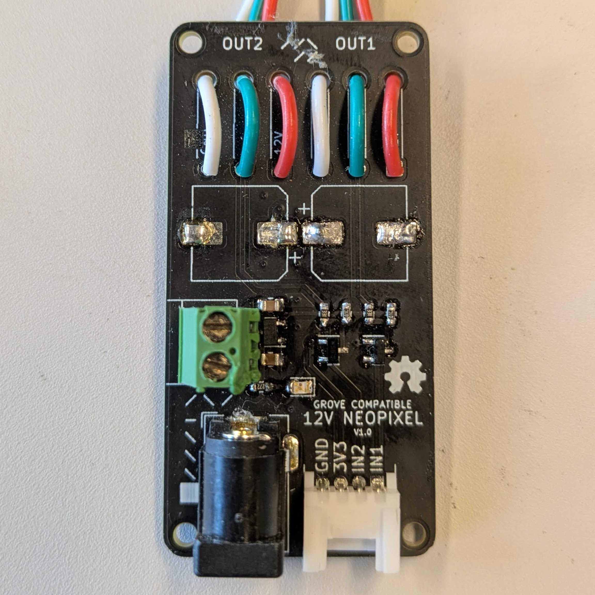

# Neopixel helper
This helper make it easy to control Neopixel ledstrips. Neopixel ledstrips often require 5 volts which can be added through the barreljack or the screw terminal. The grove connector can control two seperate Neopixel strips.
