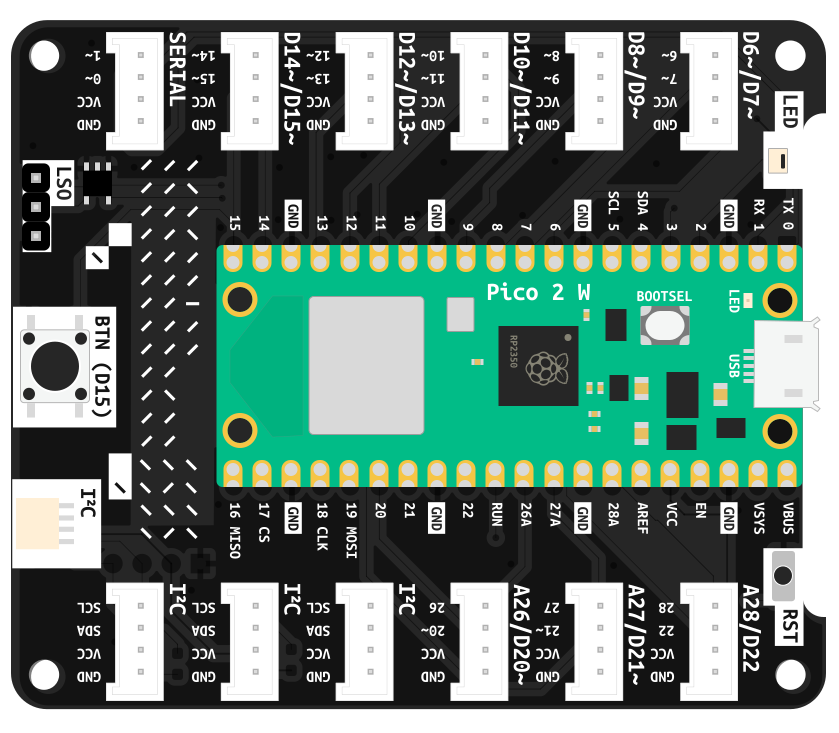

# Pico Expander  
Expands the capabilities of your microcontroller. Provides solderless connectors.  
  
---

### Features

* 12 Grove Headers
  - 5 Digital Headers with the following pins: D6, D7, D8, D9, D10, D11, D12, D13, D14, D15
  - 1 Digital Header with exclusive pins: Serial
  - 3 Analog Headers with exclusive pins: A26, A27, A28 (All contain digital pins for their second pins)
  - 3 I²C Headers
* 1 JST SH 4-pin connector for Qwiic and STEMMA QT components (I²C)
* 1 Logic-shifted output (allows driving components requiring 5V logic while powered via USB)
* 1 Button for input D15
* 1 Status LED
* 1 Reset button
* 1 Footprint for a small 128x32 pixel OLED display

## Usage Information

You will be introduced to the usage of the Pico Expander in the course of the [tutorials](../../tutorials/). The information below serves for reference. If you are interested in additional information on the capabilities of your expander board, visit the [documentation on its GitHub repository](https://github.com/id-studiolab/PicoExpander/blob/main/README.md).
