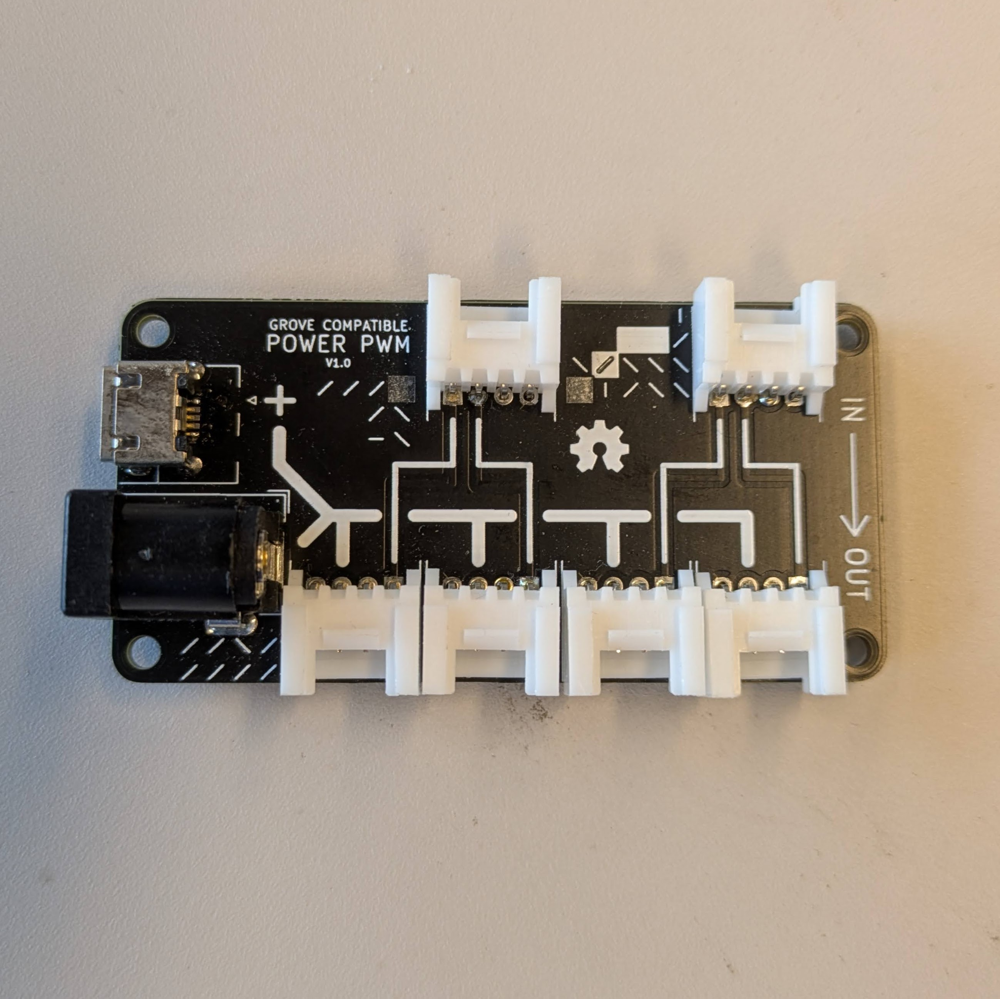

# Power PWM
A helper component to give extra power to your grove components.
Connect a grove cable on the top, each grove connector can control the outer pin of the bottom row grove connector. On the left side power can be injected through the jack plug or micro usb connector.