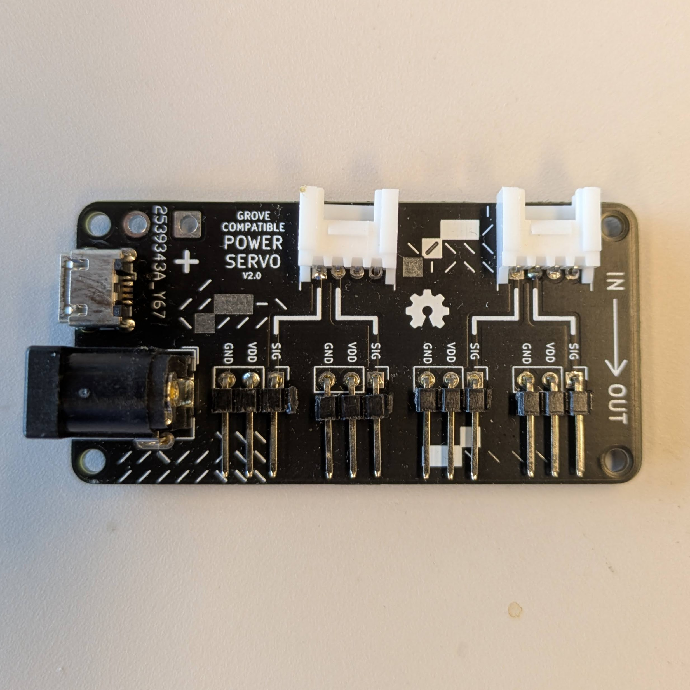

# Power Servo
<a href="../../glossary/glossary"></a> <a href="../../glossary/glossary"></a>

< one sentence explaination of item >


---

## Required Libraries
link to library

## Basic Usage

explaination
 
```python
```

explaination

```python

```

