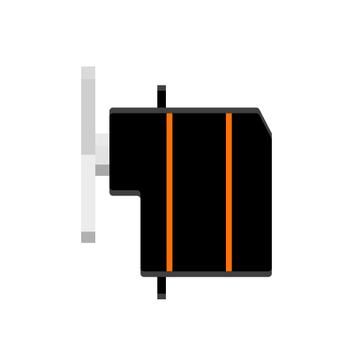

# Servo Motor
<a href="../../glossary/glossary"></a> <a href="../../glossary/glossary"></a>

A small motor with position control. Its range of motion is limited to approximately 180°.

Technical information on this component is available [here](https://wiki.seeedstudio.com/Grove-Servo/).

---

## Background

The servo motor in the kit is a standard servo motor for hobby applications, meaning it has a range of motion of 180°, as opposed to a continuous servo motor that can move its shaft continuously.

A pulse-width modulated (PWM) signal is used to control its angle. By adjusting the length of the pulse width, you can control the position of the servo motor's shaft.

{:.highlight-yellow}
To learn more about PWM signals, refer to the [Piezo Buzzer](../piezo-buzzer/piezo-buzzer#define-a-tone-using-pulse-width-modulation-pwm) example. 

## Basic Usage

This example uses the `adafruit_motor` library to control a servo motor connected to pin **`D13`**. A PWM frequency of 50 Hz is standard for driving this type of motor. The `min_pulse` and `max_pulse` values inform the library of the pulse width it needs to create to move the motor to the minimum (0°) and maximum (180°) positions, respectively. 

{:.note}
If your motor does not produce a 180° motion range correctly, you may need to adjust the `min_pulse` and `max_pulse` values. Be very careful when doing so not to break your motor!

After setting up the servo motor, you can specify the angle you want the motor to move to. It will rotate to the target position at a consistent speed. The main loop in this example iterates through the servo motor's motion range in increments of 45°.

```python
# --- Imports
import time
import board
import pwmio
from adafruit_motor import servo

# --- Variables
pwm = pwmio.PWMOut(board.D13, frequency=50)
servo_motor = servo.Servo(pwm, min_pulse=700, max_pulse=2600)

# --- Functions

# --- Setup

# --- Main loop
while True:
    for angle in [0, 45, 90, 135, 180]:
        servo_motor.angle = angle
        time.sleep(1)
```

{:.note}
If you define a new position before reaching the previous one, the motor will abort its current operation and directly move to the new position.

## Servo Sweep with Speed Control

This tutorial will look at how to control the motion speed and move between two positions more smoothly. To that end, we write a function called `sweep_servo` that takes four parameters:

- The starting position of the sweep (`start_pos`).
- The target position of the sweep (`end_pos`).
- The `duration` of the sweep.
- The `step_size` that divides the range of motion into smaller steps.

Based on these parameters, the function calculates a `delay_time` between each step. It then moves the motor through the range of angles specified using intermediate steps of the defined `step_size`. Each motion step is followed by the calculated delay time that should accumulate to the desired duration over the sweep range.

Before we enter the main loop, we initialize our motor to its 0° position and wait for a second. The main loop then uses our sweep_servo function to sweep back and forth between 0° and 180°.

```python
# --- Imports
import time
import board
import pwmio
from adafruit_motor import servo

# --- Variables
pwm = pwmio.PWMOut(board.D13, frequency=50)
servo_motor = servo.Servo(pwm, min_pulse=600, max_pulse=2600)

# --- Functions
def sweep_servo(start_pos, end_pos, duration, step_size):
    delay_time = duration / ((end_pos - start_pos) / step_size)
    for angle in range(start_pos, end_pos, step_size):
        servo_motor.angle = angle
        time.sleep(delay_time)

# --- Setup
servo_motor.angle = 0
time.sleep(1)

# --- Main loop
while True:
    sweep_servo(0, 180, 1, 3)
    sweep_servo(180, 0, 1, -3)
```
