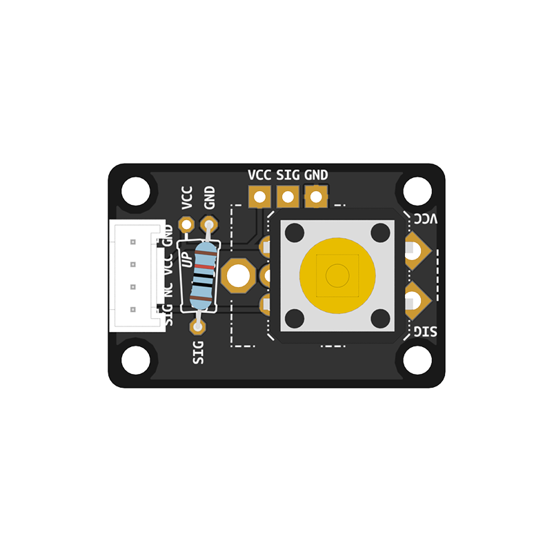

# Tactile Switch
<a href="../../glossary/glossary"></a> <a href="../../glossary/glossary"></a>

A push button that remains active while pressed.

Learn how to make your own tactile switch [here](../../tutorials/assembling-custom-components/tactile-switch).


---

## Basic Usage

The code example below reads the state of a tactile switch connected to pin **`D7`** on each run through the main loop. While the button remains pressed, it turns on the built-in LED of your microcontroller, which is internally connected to pin **`D13`**. When released, the LED is turned off again.
```python
# --- Imports
import digitalio
import time
import board

# --- Variables
switch = digitalio.DigitalInOut(board.D7)
switch.direction = digitalio.Direction.INPUT

led = digitalio.DigitalInOut(board.D13)
led.direction = digitalio.Direction.OUTPUT
# --- Functions

# --- Setup
led_state = False

# --- Main loop
while True:
    if switch.value == False:
        led.value = False
    else:
        led.value = True
```


## Toggling Between States

In the previous example, the LED's state directly depends on the state of the switch. When the button is pressed, the LED turns on, and when it is released, the LED turns off. In this code example, we modify the behavior to emulate a toggle switch, allowing the LED to toggle between on and off states each time the button is pressed. 

To achieve this, we use a variable called `last_state` to track the previous state of the switch. In the main loop, we check if the current state of the switch is different from its previous state:

```python
if switch.value != last_state:
```
When the state of the switch changes, we update the `last_state` variable. We then check if the state changed from not pressed to pressed, in which case we toggle the LED's state. That way, we ensure the LED's state changes only once per press-and-release cycle. The code also prints the toggled LED states to the serial monitor. Therefore, we also introduce a short delay to safeguard against overwhelming the serial monitor with too many messages.

```python
import digitalio
import time
import board

# --- Variables
switch = digitalio.DigitalInOut(board.D7)
switch.direction = digitalio.Direction.INPUT

led = digitalio.DigitalInOut(board.D13)
led.direction = digitalio.Direction.OUTPUT

# --- Functions

# --- Setup
last_switch_state = switch.value
led_state = False

# --- Main loop
while True:
    if switch.value != last_switch_state:
        last_switch_state = switch.value
        if switch.value:
            led_state = not led_state
            print("Enable LED" if led_state else "Disable LED")
            led.value = led_state
    
    time.sleep(0.02)
```

