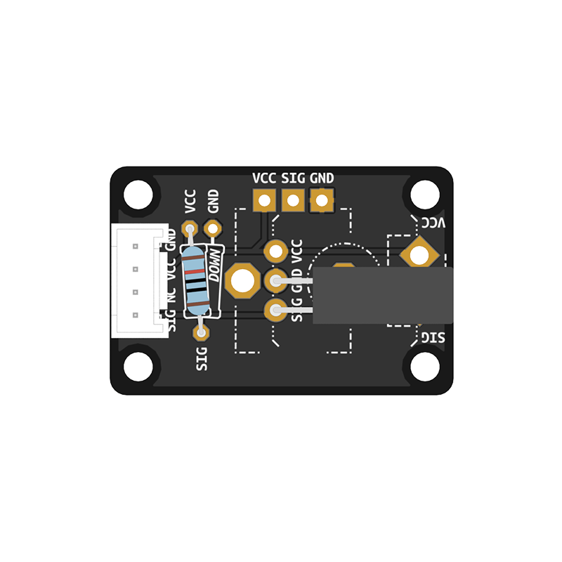

# Tilt Switch
`Input` - motion detection, detects between vertical vs. horizontal orientation depending on the placement of the sensor.

Learn how to make your own tilt switch [here](../../tutorials/04-assemble-custom-component/)

---

## Basic tilt switch example
```python
# --- Imports
import digitalio
import time
import board

# --- Variables
tilt_switch = digitalio.DigitalInOut(board.D13)
tilt_switch.direction = digitalio.Direction.INPUT

# --- Functions

# --- Setup

# --- Main loop
while True:
    if tilt_switch.value is False:
        print("False")
    else:
        print("True")
    time.sleep(0.05)  # Make the loop run a little bit slower
```
