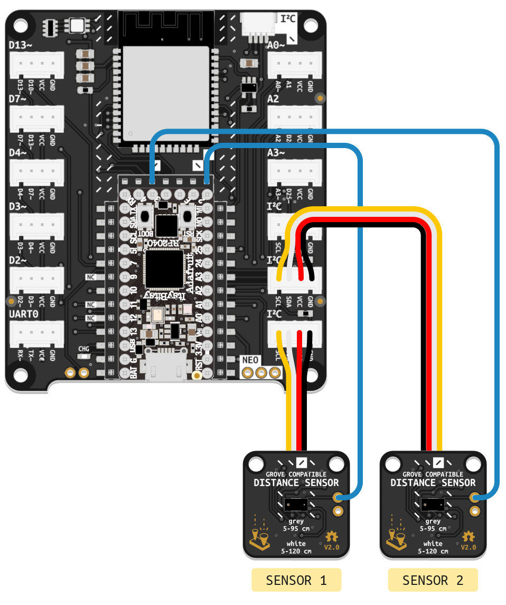

# Time of Flight Distance Sensor
<a href="../../glossary/glossary"></a> <a href="../../glossary/glossary"></a>

Detects the distance of objects directly in front of the sensor. Works best with white surfaces, for a range from 30 to 1200 mm. Works most reliably between 50 and 950 mm.

{:.note}
The sensor included in your kit may look like the one pictured above or like the one pictured here. Both versions are functionally identical. The information in this article is valid no matter which version you own.

Additional information is available on [this page](https://learn.adafruit.com/adafruit-vl53l0x-micro-lidar-distance-sensor-breakout), discussing a similar component based on the same sensor.

Additional code examples are available [here](https://github.com/adafruit/Adafruit_CircuitPython_VL53L0X/tree/main/examples).

---

## Preparation

This Distance Sensor communicates with your microcontroller using a protocol called [I²C](/glossary/glossary). To work, it must be connected to a port labeled **I²C** on the BitsyExpander Board. You will need to include the `adafruit_bus_device` [library](/glossary/glossary) in your code to read data via I²C and the `adafruit_vl53l0x` library to control the [VL53L0X](https://www.adafruit.com/product/3317) sensor itself.

These libraries should already be installed on the ItsyBitsy Microcontroller included in your kit, so you don't need to worry about installing them yourself.

{: .highlight }
You can verify that these libraries are installed by ensuring a folder named `adafruit_bus_device` and a file called `adafruit_vl53l0x.mpy` are present in the `lib` folder of your `CIRCUITPY` drive. If not, download Adafruit's Library Bundle for Version 7.x [here](https://circuitpython.org/libraries). Extract the needed file and folder from the bundle and place them in the `lib` folder on your microcontroller. You can learn more about libraries and their use in the [Glossary](/glossary/glossary) or the [Tutorials](/Tutorials).

## Basic Usage

Make sure to include `busio` and `adafruit_vl53l0x` in the imports section of your code to use the required libraries.  

The first step to using the sensor is setting up the connection by creating an `I2C` [object](/glossary/glossary) named `i2c_port`. Then, `dist_sensor = adafruit_vl53l0x.VL53L0X(i2c_port)` is used to create an [instance](/glossary/glossary) of the sensor named `dist_sensor` and connected to `i2c_port`. In the example code below, this is done in the _Variables_ section.

In the main loop, the `print()` function outputs distance readings retrieved from the sensor using `dist_sensor.range`, along with explanatory labels.

```python
# --- Imports
import time
import board
import busio
import adafruit_vl53l0x

# --- Declarations
i2c_port = busio.I2C(board.SCL, board.SDA)

# --- Functions

# --- Setup
dist_sensor = adafruit_vl53l0x.VL53L0X(i2c_port)

# --- Main loop
while True:
    print("Range:", dist_sensor.range, "mm")
    time.sleep(0.1)
```

## Using Multiple Sensors

{: .note }
Some soldering is required to follow these instructions. If this is your first time soldering, begin by reading the [Soldering Tutorial](/tutorials/04-assemble-custom-component/soldering).

{: .warning }
If following this tutorial with a microcontroller other than the one included in the Connected Interaction Kit, make sure it uses 3.3V logic. The XSHUT pin of the sensor cannot handle 5V logic and would need [level shifting](https://www.kiwi-electronics.com/en/4-channel-i2c-safe-bi-directional-logic-level-converter-bss138-837) to work with 5V microcontrollers.

The **I²C** connectors on the BitsyExpander board all share the same two digital pins (**SCL** and **SDA**), as [I²C](/glossary/glossary) is a communication protocol that enables multiple components to share the same so-called I²C bus. To organize communication, each device on the bus must have a unique address. Typically, unique addresses are assigned by default to different components. However, if you need to use multiple identical parts, they will all have the same default address, causing a conflict. 



For example, the VL530X Distance Sensor's default address is **0x29**. To use more than one of them, their addresses must first be reassigned. This can be done in code by following these steps:

- At the start of the program, all connected sensors must be turned off by driving their shutdown pins low (labeled **XSHT** or **XSHUT**). Before that can be done, a new cable must be soldered to connect the sensor's shutdown pin to a digital pin on the microcontroller. Follow the wiring diagram above to connect two sensors.
- In the code's setup section, `switch_to_output(value=False)` configures the pins connected to XSHUT as outputs with a default value of False to turn off the sensors.
- Next, the first sensor is turned on by driving its XSHUT pin high with `xshut_sensor1.value = True`, and initialized in the same manner as in the first example.
- Finally, the `set_address()` function is used to change the sensor's address.
- These steps are then repeated for the remaining sensors. In this example, the addresses of both connected sensors are changed. In principle, the last sensor could retain its default address.

Note that these steps only need to be performed once, which is why they are performed in the code's setup section. Once configured, the sensors can be used normally.

```python
# --- Imports
import time
import board
import busio
import digitalio
import adafruit_vl53l0x

# --- Declarations
i2c_port = busio.I2C(board.SCL, board.SDA)
xshut_sensor1 = digitalio.DigitalInOut(board.D2)
xshut_sensor2 = digitalio.DigitalInOut(board.D3)

# --- Functions

# --- Setup
xshut_sensor1.switch_to_output(value=False)
xshut_sensor2.switch_to_output(value=False)

xshut_sensor1.value = True
dist_sensor1 = adafruit_vl53l0x.VL53L0X(i2c_port)
dist_sensor1.set_address(0x30)

xshut_sensor2.value = True
dist_sensor2 = adafruit_vl53l0x.VL53L0X(i2c_port)
dist_sensor2.set_address(0x31)

# --- Main loop
while True:
    print((dist_sensor1.range, dist_sensor2.range))
    time.sleep(0.1)
```

{: .note }
If you need more than three sensors or want to avoid soldering, consider using an [I²C Multiplexer](https://learn.adafruit.com/adafruit-tca9548a-1-to-8-i2c-multiplexer-breakout/) or [configuring a second I²C bus](https://learn.adafruit.com/circuitpython-essentials/circuitpython-i2c#wheres-my-i2c-2985160) instead.

## Additional Resources

### [Working with I²C Devices](https://learn.adafruit.com/working-with-i2c-devices)

Adafruit's extensive learning resource on the I²C standard

### [Resolving I²C Address Conflicts](https://learn.adafruit.com/working-with-multiple-i2c-devices)

Adafruit's guide exploring methods to resolve I²C address conflicts
