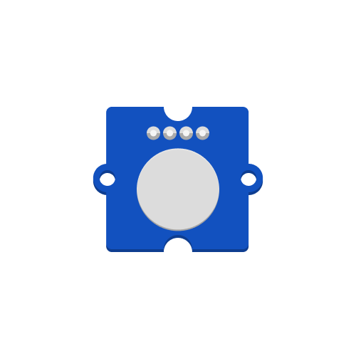

# Touch Sensor
`Input` - detects if touched or not, can detect touch through thin material.

More detailed component information can be found [here](https://www.seeedstudio.com/Grove-Touch-Sensor.html).

---

## Example code
If the touch sensor is touched, turn the internal LED on. Otherwise turn the LED off.
```python
# --- Imports
import digitalio
import time
import board

# --- Variables
led = digitalio.DigitalInOut(board.D13)
led.direction = digitalio.Direction.OUTPUT
touch = digitalio.DigitalInOut(board.D7)
touch.direction = digitalio.Direction.INPUT

# --- Functions

# --- Setup
led.value = False

# --- Main loop
while True:
    print("hello world")
    if touch.value == False:
        led.value = False
    else:
        led.value = True
    time.sleep(0.05)  # Make the loop run a little bit slower

```

