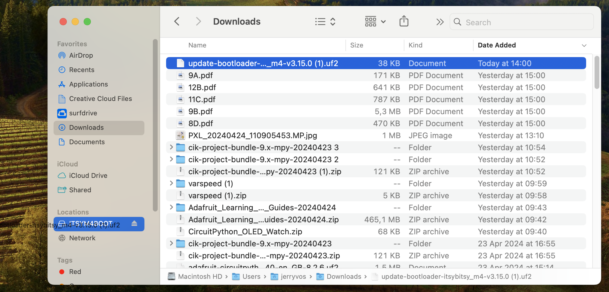

# Getting help

## Why is my code not working?

{:.note}
Should you run into issues during coding please first carefully read the troubleshooting page.

[Troubleshooting page](troubleshooting){: .btn .btn-blue }

## What can I connect where?
To give you a clear overview we made the following pinout page:  
[Pinout page](pinout)


## What do I do when hardware components are not working?
In case any of your components not working as expected, please check the [documentation page](../components/index) of the component first and try getting it running with the example code first.

Most issues can be fixed by double-checking the following:
1. Is your component connected to the right port of the Expander board?
2. Is your ItsyBitsy properly plugged into your computer?
3. Does an error message appear in MU's `Serial monitor`, indicating a software issue (e.g. typos, coding mistake, missing library, etc.)

If you checked the points above thoroughly and your component is still not working, you can find extra help at IO's [Model Making and Machine Lab (PMB)](https://www.tudelft.nl/io/over-io/faciliteiten/pmb).

## Where can I get more hardware components?
The Connected Interaction Kit can be extended with additional Grove components. Every Grove component should work.

You can get additional components at following places:
1. Left-over and used Grove components can be gathered from the [PMB](https://www.tudelft.nl/io/over-io/faciliteiten/pmb) for free
2. New Grove components can be bought at the [PMB](https://www.tudelft.nl/io/over-io/faciliteiten/pmb) for 1€ per piece
3. Depending on the course, components can be borrowed temporarily from IO's StudioLab and Applied Lab
4. Bought online, for instance at [Kiwi Electronics](https://www.kiwi-electronics.nl/en/home)


## Where can I get support for prototyping for courses?
Each course using the Connected Interaction Kit will have their own tech support that can guide and support you in learning prototyping.

## How do I upgrade my Circuit Python version?  

|                       For Itsy Bitsy M4                        |                        For RP2040 Expander                        |
| :----------------------------------------------------------: | :----------------------------------------------------------: |
|  |  |
| [Start upgrade](upgradeCP_M4){: .btn .btn-blue } | [Start upgrade](upgradeCP_RP2040){: .btn .btn-blue } |

## How do I install the required Circuit Python libraries?
1. Open the latest version of our project bundle  

[Download Project Bundle](https://github.com/id-studiolab/CIK-Project-Bundle/releases/latest){: .btn .btn-blue }

2. Download the cik-project-bundle-9.x-mpy.zip file
3. Unzip the file on your computer
4. Copy the complete lib folder
5. Paste the complete lib folder in the CIRCUITPY drive
6. Press replace if prompted.


## How do I install other Circuit Python libraries?
*Guide based on [Adafruit update page](https://learn.adafruit.com/adafruit-itsybitsy-rp2040/circuitpython-libraries), check this page for more in-depth guidance*


1. Download the CircuitPython Library you want. You can find the complete Adafruit CircuitPython bundle or the community bundle from this [page](https://circuitpython.org/libraries).  
  
 
1. Unzip the file and copy the desired file(s) to the ```lib``` folder on your ItsyBitsy

Alternatively you can read more about libraries on the following page: [libraries](libraries)

# How to upgrade the ItsyBitsy M4 bootloader
This is only for the Itsy Bitsy M4. *Guide based on [Adafruit update page](https://learn.adafruit.com/introducing-adafruit-itsybitsy-m4/update-the-uf2-bootloader), check this page for more in-depth guidance*

{:.note}
This is a guide to update the bootloader, not a guide to update the Circuit Python version

1. Connect ItsyBitsy to your computer, you should see a USB drive appear as: CIRCUITPY

2. Double-click the RESET button, the drive disappears and reappears as: ITSYM4BOOT

  
1. Open the ```INFO_UF2.TXT```, you should see something like ```UF2 Bootloader v2.0.0```, this shows you the current version of the bootloader you are using.  
  
1. Download the latest version **AT THE END** of [this page](https://circuitpython.org/board/itsybitsy_m4_express/#:~:text=Update%20UF2%20Bootloader) under “Update UF2 Bootloader”  
  
1. Drag the .uf2 file to the ITSYM4BOOT drive.  
  
1. Open the ```INFO_UF2.TXT```, you should see something like ```UF2 Bootloader v3.15.0```, this shows you the current version of the bootloader you are upgraded to.   
  