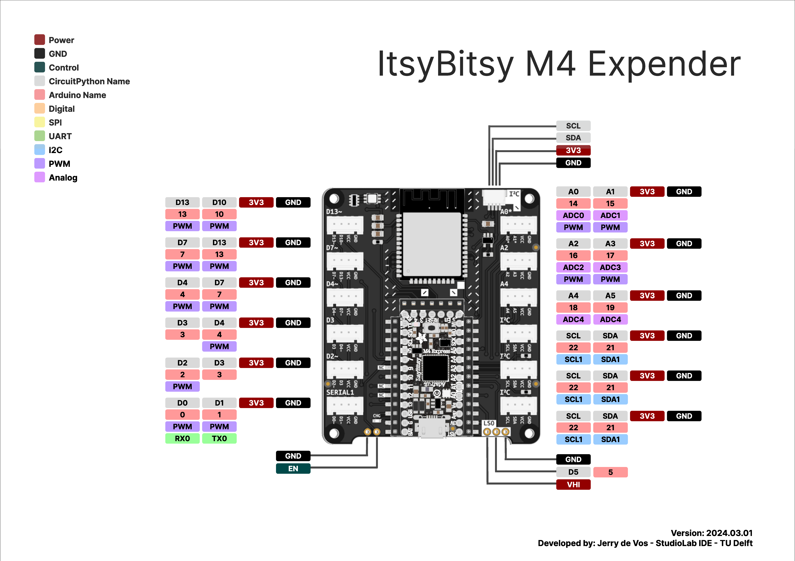
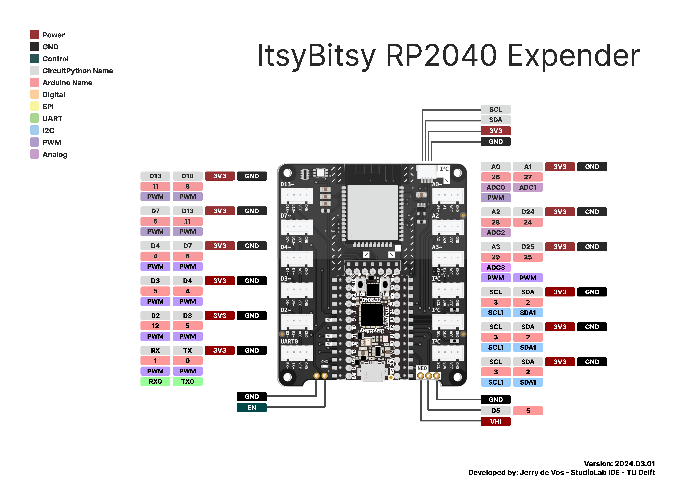

# Pinouts
## Pinout for the Pico 2W
  

[Original](assets/pico2w.pdf)    
   
  
## Pinout for the Pico 2W in the Expander
  

[Original](assets/PicoExpander.pdf)  

## Pinout for the Itsy Bitsy M4
  

[Original](assets/ItsyBitsyM4.pdf)    
   
  
## Pinout for the Itsy Bitsy M4 in the Expander
  

[Original](assets/ItsyBitsyM4Expander.pdf)    
   
  
 
## Pinout for the Itsy Bitsy RP2040
  

[Original](assets/ItsyBitsyRP2040.pdf)    
   
  
 
## Pinout for the Itsy Bitsy RP2040 in the Extender
  

[Original](assets/ItsyBitsyRP2040Expander.pdf)    
   
  
 
