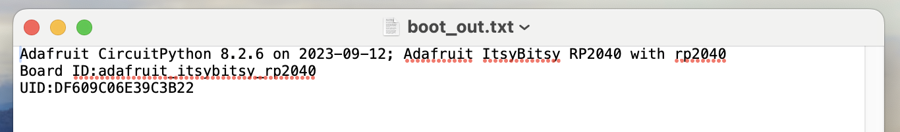

# How to upgrade to Circuit Python for RP2040
*Guide based on [Adafruit update page](https://learn.adafruit.com/adafruit-itsybitsy-rp2040/circuitpython), check this page for more in-depth guidance*

<div style="padding:56.25% 0 0 0;position:relative;"><iframe src="https://player.vimeo.com/video/1012520835?h=b8be21a3a2&amp;badge=0&amp;autopause=0&amp;player_id=0&amp;app_id=58479" frameborder="0" allow="autoplay; fullscreen; picture-in-picture" allowfullscreen style="position:absolute;top:0;left:0;width:100%;height:100%;" title="Photoresistor"></iframe></div><script src="https://player.vimeo.com/api/player.js"></script>

1. Connect ItsyBitsy to your computer, you should see a USB drive appear as: CIRCUITPY  

2. Find out which version of CircuitPython you are running currently, you can use step a **OR** step b
   1. Open the CIRCUITPY drive and open the ```boot_out.txt``` file. you should see something like ```Adafruit CircuitPython 8.2.6``` this is the version of CircuitPython you are currently using. If this is already shows the version you want to upgrade to, you can stop this tutorial.  
  
    2. Open MU editor, press the serial button, and in the REPL you should also see your version of CircuitPython printed.  
 

3. Hold down the BOOT button, while holding this press and release the RESET button, the drive disappears and reappears as: RPI-RP2  

  
  
1. Download the latest stable version of CircuitPython at [this page](https://circuitpython.org/board/adafruit_itsybitsy_rp2040/) by pressing the ```Download .uf2 now```  button.


1. Drag the .uf2 file to the RPI-RP2 drive, the drive disappears and reappears as: CIRCUITPY 
  
  

6. To find out if the upgrade was successful you can use step a **OR** step b
   1. Open the CIRCUITPY drive and open the ```boot_out.txt``` file. you should see something like ```Adafruit CircuitPython 9.0.4``` this is the version of CircuitPython you are now upgraded to.
  
   1. Open MU editor, press the serial button, and in the REPL you should also see your version of CircuitPython printed. this is the version of CircuitPython you are now upgraded to.
 