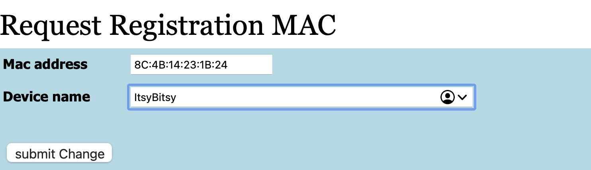

# Step 3: Registering your device with TUD-facility

1. Take your smartphone and scan the QR code on the inside of your Connected Interaction Kit.
2. Follow the link and log in with your TU Delft NetID.
3. Enter the MAC address you found in [Step 2: Find out your ItsyBitsy's MAC address](/docs/tutorials/03-connect-to-the-internet/step-2.md), using a colon `[:]` as a separator. Fill in  `ItsyBitsy` as a device name.

4. Click `Submit Change`.
  
5. Copy and save the `iPSK String`. This will be your password for the following step.
