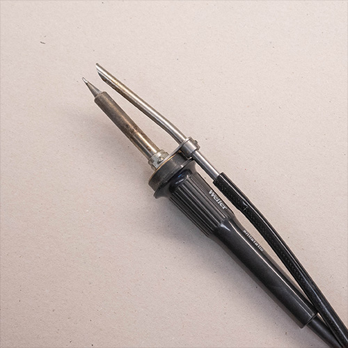
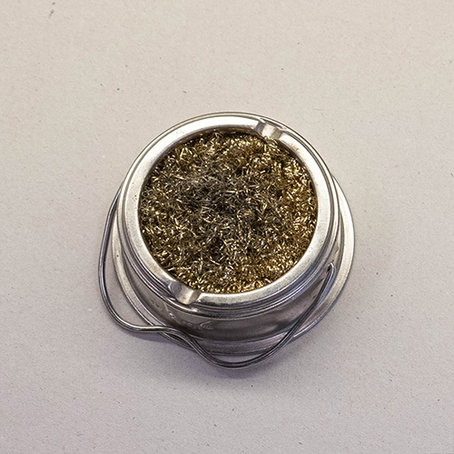
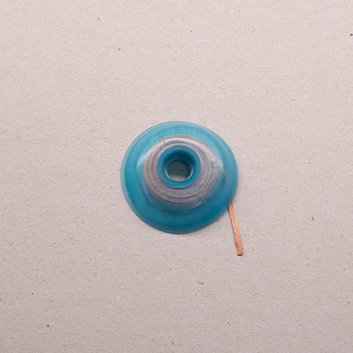
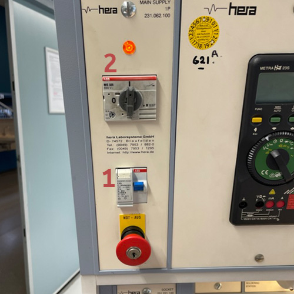
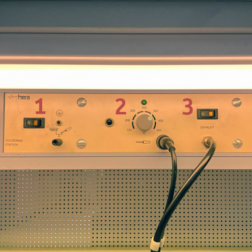
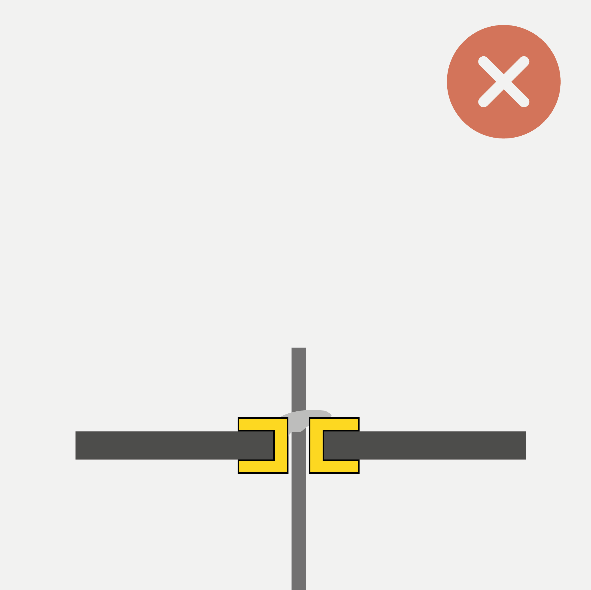
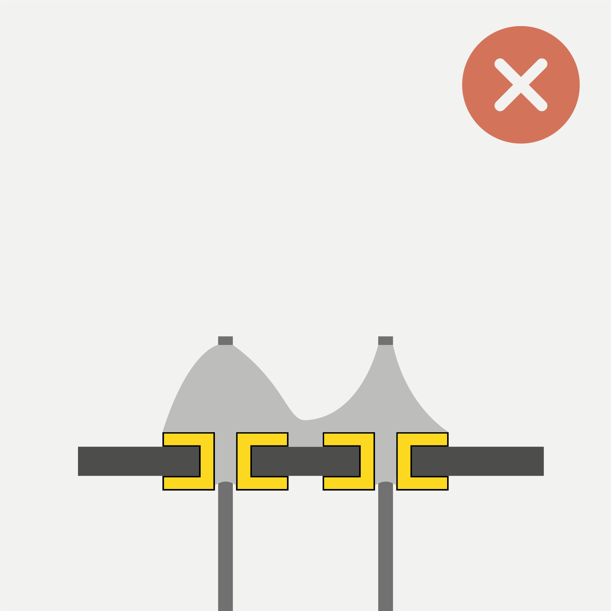
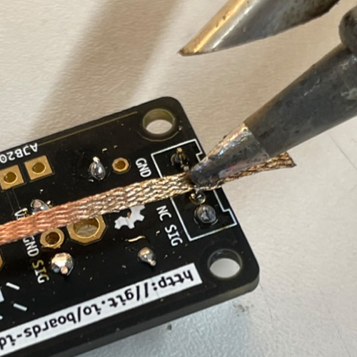

# Soldering: Tools and Technique

*Fore a more complete introduction into soldering, we recommend reading Sparkfun's excellent guide [HERE](https://learn.sparkfun.com/tutorials/how-to-solder-through-hole-soldering/).*

## Introduction

This guide intends to be a short read covering the basics of soldering using the tools available in the PMB. 

If you are already familiar with the tools we will work with, you may skip ahead to the following sections:

* [How to Solder Trhough-Hole Components](#how-to-solder-through-hole-components)
* [How to Find and Fix Bad Connections](#how-to-find-and-fix-bad-solder-joints)

First, let us take a look at the tools we will need:

### Essential Tools

| Soldering Iron                                     | Brass Sponge                                       | Stand                                      |
| -------------------------------------------------- | -------------------------------------------------- | ------------------------------------------ |
|  |  |  |
| The most important tool you will be working with.  | To keep the iron clean and in working order.       | For safely storing the iron while hot.     |

| Solder (with flux core)                                    | Flush Cutters                                             | Vise or Third Hand                           |
| ---------------------------------------------------------- | --------------------------------------------------------- | -------------------------------------------- |
|                |       |      |
| To join components together electrically and mechanically. | For trimming excess leads and cutting components to size. | To hold your workpiece while you work on it. |

### Nice-to-Haves

| Flux Pen                                                     | Solder Wick                                                  | Sticky Putty                                                 |
| ------------------------------------------------------------ | ------------------------------------------------------------ | ------------------------------------------------------------ |
|  |  |  |
| Used to make solder flow better. Needed for repairs and solder whithout flux core. | Used to "soak up" excess solder. Important for repairing or reworking a solder joint. | Can help holding components, wires, or wick in place during the soldering process. |

## How to Solder Through-Hole Components

| Before you begin                                             |                                                              |
| :----------------------------------------------------------- | ------------------------------------------------------------ |
| Make sure the power to your work station is turned on. Ensure the circuit breaker **(1)** is in the "ON" position (up), then turn on the switch **(2)**. If the power remains off, the Emergency Stop button may be tripped, ask for assistance. |  |

| **Step 1: Pre-heat the iron**                                |                                                              |
| :----------------------------------------------------------- | ------------------------------------------------------------ |
| Turn on the exhaust and the soldering iron. Set the iron to **370°C** and let it heat up for a few seconds. (370°C works best for the lead-free solder, for leaded solder use 340°C) |  |

| Step 2: Clean and tin the tip                                |                                                              |
| :----------------------------------------------------------- | ------------------------------------------------------------ |
| Make sure the tip of your soldering iron is shiny. If it is blackened and matte, dirt and oxidation will prevent the heat from transfering into the joint. In this case, wipe the tip of the iron in the brass sponge to clean it. Then tin it by applying a bit of solder to the tip.   ***The tip should look shiny before you proceed.*** |  |

| Step 3: Seat a component                                     |                                                              |
| :----------------------------------------------------------- | ------------------------------------------------------------ |
| Insert one or more components and fix them. Components with flexible leads (e.g. resistors) can be easily fixed by bending the legs on the back of the PCB. Other components are easier to fix with a vise or some sticky putty. **Avoid short-circuits** by checking that components are not touching any other conductive parts of the board ([as shown here](#inspect-your-component-leads)).   ***Secure the hot soldering iron in the stand while you do this.*** |  |

| Step 4: Make a joint                                         |                                                              |
| :----------------------------------------------------------- | ------------------------------------------------------------ |
| Apply heat to the joint you want to solder for a few seconds. Make sure you heat the pad and the lead at the same time. Then feed some solder wire into the joint until it is **fully covered** in solder and forms a tent shape. (If the through-hole is much wider than the component lead, it is OK if the joint is flat.)   ***Make sure to feed solder directly into the pre-heated joint! DON'T apply solder to the tip of your iron and try to "wipe" it into the joint!*** |  |

| Step 5: Trim excess leads                                    |                                                              |
| :----------------------------------------------------------- | ------------------------------------------------------------ |
| Use the flush cuttes to cut excess leads as close as possible to the board. |  |

| Step 6: Inspect                                              |                                                              |
| ------------------------------------------------------------ | ------------------------------------------------------------ |
| Check that all the joints look good and no solder bridges/short circuits exist. Check the [following paragraph](#how-to-find-and-fix-bad-connections) for guidance on finding and resolving issues. |  |

| Step 7: Wrap-up                                              |                                                              |
| ------------------------------------------------------------ | ------------------------------------------------------------ |
| Tin the tip of the iron (see step 2) so the next person finds it in working order.   ***Don't forget to turn off your iron. If no one else is working at the station when you leave, turn off the main power.*** |  |

## How to Find and Fix Bad Connections

### Inspect your Component Leads

| Avoid Shorts                                                 |                                                              |
| ------------------------------------------------------------ | ------------------------------------------------------------ |
| Make sure the leads of your mounted components don't kink or touch pads on the circuit board they are not supposed to. This can otherwise lead to unexpected behavior or render the component completely non-functional. |  |

### Inspect your Solder Joints

### *Good Joints*

| Concave Tent Shape                                           | Convex Tent Shape                                            | Separation between Joints                                    |
| ------------------------------------------------------------ | ------------------------------------------------------------ | ------------------------------------------------------------ |
|    |  |  |
| Convex tent shape - the solder covers the entire pad. The ideal outcome. | This might look like too much solder, however it is a good joint. | There is a clear separation between joints, they do not touch one another. |

***Note:** If the mounting hole is much bigger than the component lead, there will not be a distinct tent shape. In that case, it is fine if the joint is flush or lentil-shaped as long as it evenly covers the entire pad.*

### *Bad Joints*

| Cold Joint (Pad)                                             | Cold Joint (Pin)                                             | Insufficient Wetting                                         |
| :----------------------------------------------------------- | :----------------------------------------------------------- | :----------------------------------------------------------- |
|      |  |  |
| **Problem:** Joint is unevenly heated, so the solder only flows onto the hot parts (In this case, the pad was too cold). Can also be caused by insufficient flux. | **Problem:** Components moved while solder was solidifying. Can introduce cracks between component and pad. Can also happen to good joints over time (if they are under repeated mechanical stress). | **Problem:** Not enough heat, so the solder does not fully liquefy. It does not flow nicely and refuses to "cling" to the components (it does not want to wet the components). |
| **Solution:** Add flux, retouch joint with hot iron (apply heat for at least it for 2-3 seconds). | **Solution:** Add flux, retouch joint with hot iron (apply heat for at least it for 2-3 seconds). | **Solution:** Add flux, reheat the joint, add solder.        |

| Too Much Solder                                              | Too Little Solder                                            | Solder Jumper (Short-Circuit)                                |
| :----------------------------------------------------------- | :----------------------------------------------------------- | :----------------------------------------------------------- |
|  |  |  |
| **Problem:** Too much solder is applied. It forms a ball, or even flows over its pad. | **Problem:** Not enough solder is applied. It does not fill the through hole and isn't able to flow onto the entire pad/component leg. | **Problem:** Too much solder on neighboring joints merges them to cause a short-circuit. Can also be due to insufficient heat and flux, preventing surface tension from "pulling" the solder onto the pads. |
| **Solution:** Add a bit of flux, then use wick to remove excess solder. [See below](#how-to-use-solder-wick-to-rework-a-joint) on how to use solder wick. | **Solution:** Reheat the joint, add solder.                  | **Solution:** Add a bit of flux, apply heat, then drag the iron across shorted joints. If the problem persists, use wick to remove excess solder. [See below](#how-to-use-solder-wick-to-rework-a-joint) on how to use solder wick. |

### How To Use Solder Wick to Rework a Joint

| Step 1: Position Wick                                        |                                                              |
| :----------------------------------------------------------- | ------------------------------------------------------------ |
| Apply some flux to the joint you wish to rework. Then position the wick. |  |

| **Step 2: Apply Heat**                                       |                                                              |
| :----------------------------------------------------------- | ------------------------------------------------------------ |
| Apply heat to the joint through the wick. Make sure to fix the wick without touching it, e.g. using sticky putty.   ***Wick conducts heat very fast and can burn your fingers! Make sure not to touch it while heating it!*** |  |

| Step 3: Soak Up Excess Solder                                |                                                              |
| :----------------------------------------------------------- | ------------------------------------------------------------ |
| Keep applying heat while the wick soaks up the melting solder. Remove the wick while still hot. **Don't rip it off with force!** If it sticks, re-apply some heat for the solder to melt. Removing the wick should not require applying force.  Add solder back into the joint if needed. |  |

