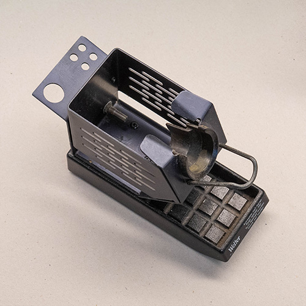
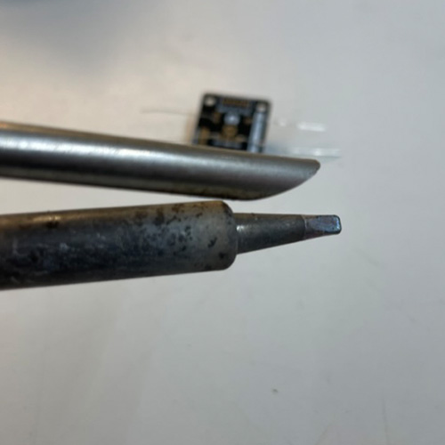
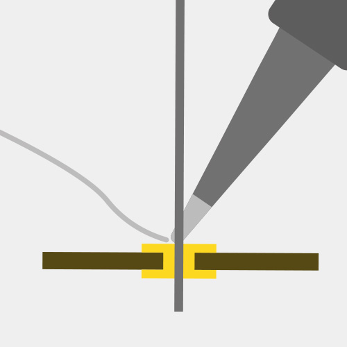
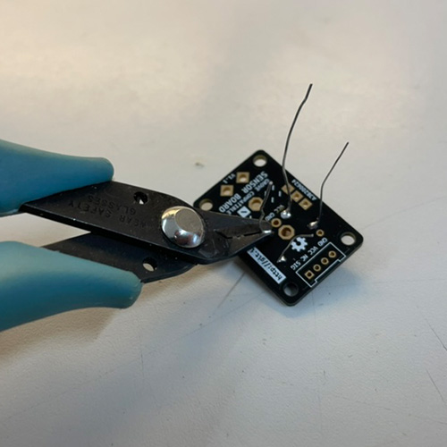

# Soldering: Tools and Technique

*Fore a more complete introduction into soldering, we recommend reading Sparkfun's excellent guide [HERE](https://learn.sparkfun.com/tutorials/how-to-solder-through-hole-soldering/).*

## Introduction

This guide intends to be a short read covering the basics of soldering using the tools available in the PMB. 

If you are already familiar with the tools we will work with, you may skip ahead to the following sections:

* [How to solder trhough-hole components](#how-to-solder-through-hole-components)
* [How to find and fix bad solder joints](#how-to-find-and-fix-bad-solder-joints)

First, let us take a look at the tools we will need:

### Essential Tools

| Soldering Iron                                     | Brass Sponge                                       | Stand                                      |
| -------------------------------------------------- | -------------------------------------------------- | ------------------------------------------ |
|  |  |  |
| The most important tool you will be working with.  | To keep the iron clean and in working order.       | For safely storing the iron while hot.     |

| Solder (with flux core)                                    | Flush Cutters                                             | Vise or Third Hand                           |
| ---------------------------------------------------------- | --------------------------------------------------------- | -------------------------------------------- |
|                |       |      |
| To join components together electrically and mechanically. | For trimming excess leads and cutting components to size. | To hold your workpiece while you work on it. |

### Nice-to-Haves

| Flux Pen                                                     | Solder Wick                                                  |
| ------------------------------------------------------------ | ------------------------------------------------------------ |
|  |  |
| Add flux a solder joint for repair work or to make the solder flow better. NEEDED IF WORKING WITH SOLDER WITH NO FLUX CORE. | Can be used to "soak up" excess solder. Important in removing solder bridges, desoldering components, and other repair work. |

## Procedure

### How to solder through-hole components

| Step                                     | Description                                                  | Preview                                                      |
| ---------------------------------------- | ------------------------------------------------------------ | ------------------------------------------------------------ |
| **0. Before you begin**                  | Make sure the power to your work station is turned on.       |  |
| **1. Pre-heat the iron**                 | Turn on the exhaust and the soldering iron. Set the iron to 370°C and let it heat up for a few seconds. (370°C works best for the lead-free solder, for leaded solder use 340°C) |                |
| **2. Clean and tin the tip** (if needed) | Make sure the tip of your soldering iron is shiny. If it is blackened and matte, dirt and oxidation will prevent the heat from transfering into the joint. In this case, wipe the tip of the iron in the brass sponge to clean it. Then tin it by applying a bit of solder to the tip. It should look shiny before you proceed. |  |
| **3. Seat a component**                  | Insert one or more components and fix them. Components with flexible leads (e.g. resistors) can be easily fixed by bending the legs on the back of the PCB. Other components are easier to fix with a vise. Avoid short-circuits by checking that components are not touching any other conductive parts of the board. **Secure the hot iron in the stand while you do this.** |  |
| **4. Make a joint**                      | Apply heat to the joint you want to solder for a few seconds. Make sure you heat the pad and the lead at the same time. Then feed some solder wire into the joint until it is fully covered in solder and forms a tent shape. |                  |
| **5. Trim excess leads**                 | Use the flus cuttes to cut excess leads as close as possible to the board. |                |
| **6. Inspect**                           | Check that all the joints look good and no solder bridges/short circuits exist. Check the following paragraph for guidance on finding and resolving issues. |            |
| **7. Wrap-up**                           | Clean the tip of the iron (see step 2) so the next person finds it in working order, and turn off your iron. If no one else is working at the station when you leave, turn off the main power. |               |

### How to find and fix bad solder joints

Instructions coming soon
{: .label .label-yellow }

