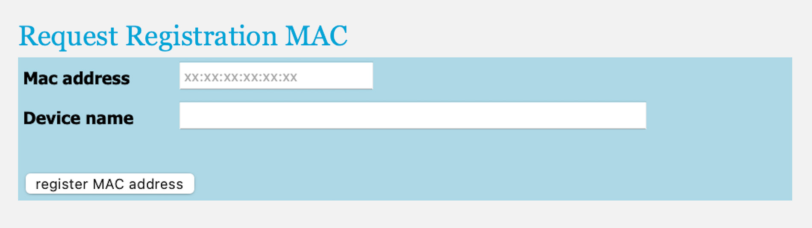

# Part 2 - Register Your Device for Use on Campus

{:.important}
This step must be performed before you connect your microcontroller to the internet on campus for the first time. If you completed this step before or are using a personal network (e.g., your home network or your phone's mobile hotspot), you can [skip this step](part-3).

As mentioned in the introduction, security measures on campus prevent your microcontroller from using the `eduroam` network. To access the internet, you will need to connect it to `TUD-facility` instead. To do so, you must first register your device's [MAC address](../../glossary/glossary) with your NetID.

1. Using your smartphone's camera app, scan your personal access token (the QR code in the lid of the box of your Connected Interaction Kit) and log in with your NetID.

2. Tap the `Register devices` button at the bottom of the page.

3. Enter the MAC address you identified for your Expander Board in [part one of this tutorial](part-1), and choose a name for your device.  

   

4. Tap the `Register MAC Address` button and confirm. A new section for the device you registered will appear under `Registered Devices`. 

5. Find the `iPSK` and write it down or save it. It will serve as the password to connect to the `TUD-facility` WiFi network in the following step.

     

{:.note}
You can register up to three devices using your personal access token (QR code). Please note that **the MAC address is associated with the Expander Board**, not the ItsyBitsy Microcontroller. If you change Expander boards or want to use other devices on `TUD-facility`, you must repeat these steps to link their MAC addresses to your token.

[Next Step](part-3){: .btn .btn-blue }