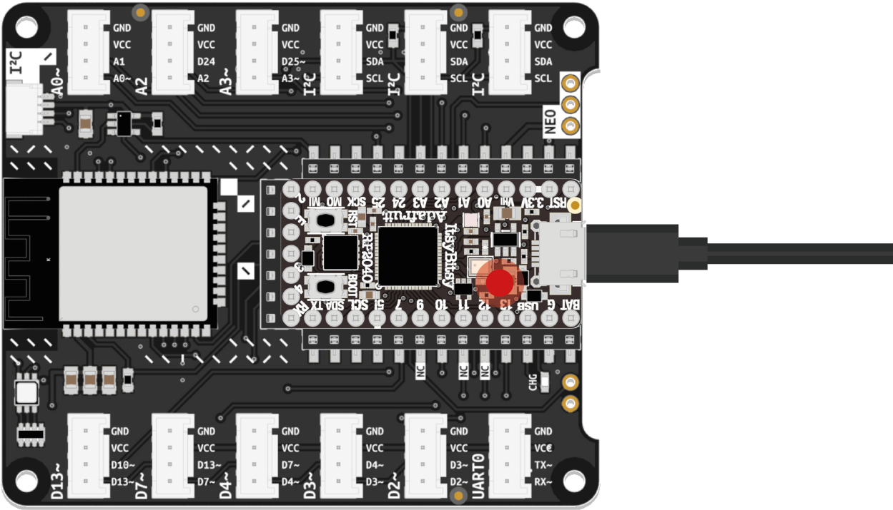

# Part 1 - Load the program code using Mu Editor

Once your microcontroller has power, the pre-loaded code should make the onboard LED blink. To see the code and start making modifications, follow these steps: 

1. Using the USB cable included in the kit, connect the ItsyBitsy to your computer. It will appear in your computer's file manager as a storage device called `CIRCUITPY`. 

1. Open Mu Editor. Click the Load button in the toolbar at the top of the program window and navigate to the `CIRCUITPY` drive. Find the file named `code.py` and open it. 

1. Your microcontroller will execute any code stored in that file. Briefly examine the example code and see if you understand some parts. In the next step, we will take a closer look at how it works and how to tweak it.

{:.note}
Once you store changes in `code.py` to the `CIRCUITPY` drive, your ItsyBitsy will begin running the new code immediately. Changes will persist even after disconnecting the ItsyBitsy from your computer.

[Next Step](part-2){: .btn .btn-blue }
