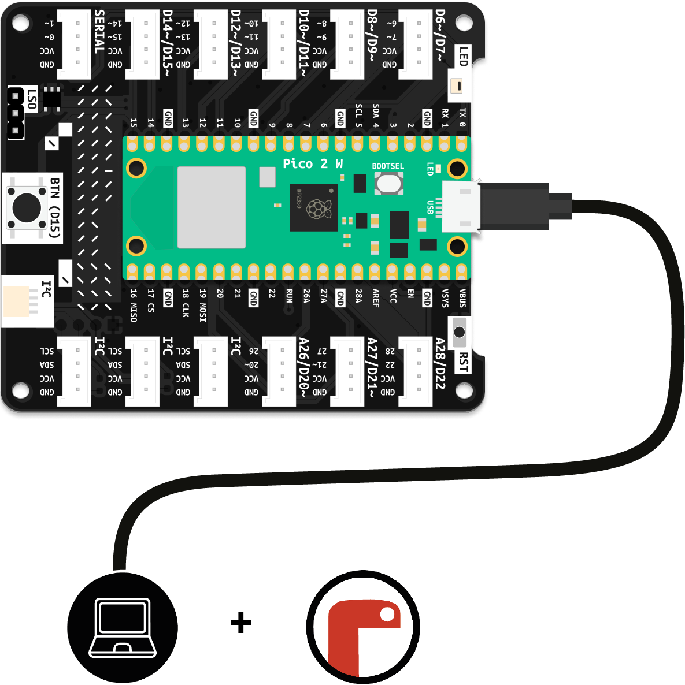

# Tools and Equipment

These are the tools and equipment you need to get started:

### ItsyBitsy + Expander
The ItsyBitsy microcontroller and its Expander form the hardware platform you will be using. When connected to your computer using the included USB data cable, the ItsyBitsy will appear as a storage device called `CIRCUITPY`.

### Your Computer + Mu Editor
You could, in theory, use any text editor to write programs for your microcontroller. In practice, you should always use a code editor, as it will simplify things greatly. The `Mu Editor` is free, open-source, and great for beginners. It spots errors, highlights important code passages, and helps structure your program. It has excellent `CircuitPython` support and offers important features for working with microcontrollers.

[Install Mu Editor](installing-mu-editor){: .btn .btn-blue }

