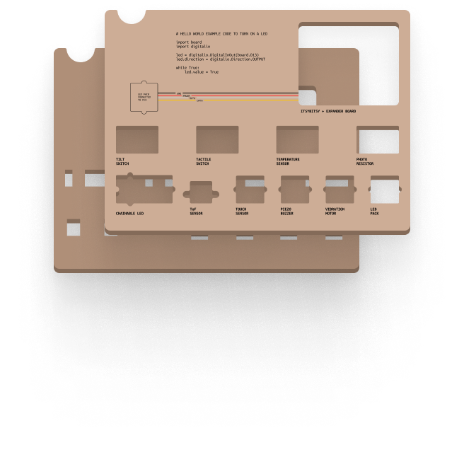
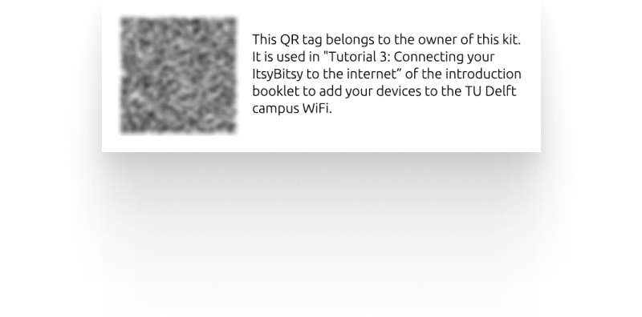

# Physical Box Production
- [Physical Box Production](#physical-box-production)
  - [Overview of ordered material](#overview-of-ordered-material)
  - [Add a box branding](#add-a-box-branding)
    - [Needed tools and material](#needed-tools-and-material)
    - [Making the stamp](#making-the-stamp)
    - [Using the stamp to add a box branding](#using-the-stamp-to-add-a-box-branding)
    - [Learnings](#learnings)
  - [The cardboard inlay](#the-cardboard-inlay)
    - [Needed tools and material](#needed-tools-and-material-1)
    - [Step 1: Print labels on Kraftpapier](#step-1-print-labels-on-kraftpapier)
    - [Step 2: Lasercut cardboard blanks](#step-2-lasercut-cardboard-blanks)
    - [Step 3: Glueing together labels and top inlay blanks](#step-3-glueing-together-labels-and-top-inlay-blanks)
    - [Step 4: Lasercut the top inlay](#step-4-lasercut-the-top-inlay)
    - [Step 5: Glue together top and bottom part of the inlay](#step-5-glue-together-top-and-bottom-part-of-the-inlay)
  - [Generating QR code stickers](#generating-qr-code-stickers)
  - [Assembling the final kit](#assembling-the-final-kit)
    - [Step 1: Preparing the box](#step-1-preparing-the-box)
    - [Step 2: Add underside of components](#step-2-add-underside-of-components)
    - [Step 3: Stack and add inlay](#step-3-stack-and-add-inlay)
    - [Step 4: Add the introduction booklet](#step-4-add-the-introduction-booklet)
    - [Step 4: Close the box](#step-4-close-the-box)

## Overview of ordered material
| Name | Ordered amount | Explanatory note | Learning |
| :--- | :--- | :--- | :--- |
| [Cardboard Box (A5, 50mm)](link) | 22 packs (20 boxes each)  | Boxes for the kit, ordered at [Pressel.com](https://www.pressel.com/p/pressel-klappdeckel-boxen-a5-220x157x50mm-braun-20-stuck/90401?SearchTerm=90401) and due to limited stock at also at [Kantoorartikelen.nl](https://www.kantoorartikelen.nl/p/1569130/pressel-klapdekseldoos-a5-220-x-157-x-50mm-bruin-pak-20-stuks-).  | Good looking and affordable boxes, but propably better to go for a two-piece box like [this one](https://www.pressel.com/p/pressel-stulpdeckel-karton-braun-220x151x44mm/90503) to have no flaps on the inside of the box that interfere with the inlay and content. Even better if these boxes can be printed on at the factory alreadt to save some manufacturing hassle |
| [Cardboard Sheets (1170x770)](https://www.pressel.com/p/pressel-karton-zwischenlagen-2-wellig-1170x770mm/830801?SearchTerm=830801) | 60 | Used as a basis to lasercut the box inlays |  There is [another version](https://www.pressel.com/p/pressel-karton-zwischenlagen-1-wellig-1170x770mm/830800?tracking=searchterm:1170x770mm) with only 1 layer of corrugated cardboard which might be more suited for the inlay to keep it flatter and the stacked components easier to remove |
| [Kraftpapier A4 120g](https://discountoffice.nl/p/kraftpapier-folia-din-a4-120gr/) | 5 packs (100 sheets each) | Used to print on component names before gluing it the inlay | The paper has a nice color that matches the boxes closely. Cutting out ~A5 paper from the A4 sheets led to some waste, but the inlay design was unfortunately bigger than exaclty A5 (210x148mm) |
| [Bruna label paper](https://www.bruna.nl/kantoor/etiket-bruna-105x37mm-240stuks-796398) | 2 packs (16 sheets / 240 stickers each) | Used to print the QR code stickers on | / |
| Spray Glue | 6-8 bottles | Used to fuse together the three inlay pieces | We needed way more glue than anticipated. Also, **not all glue is equal**! Either go for HEMA spray glue or [Bison Lijmspray](https://www.gamma.nl/assortiment/bison-lijmspray-spuitbus-transparant-500-ml/p/B484020), as the cheaper [Handson spray](https://www.gamma.nl/assortiment/handson-lijmspray-spuitbus-400-ml/p/B604459) was way to concentrated in its spray beam, which led to blotchy paper and more glue usage than needed |
| [Laser rubber](https://www.kopierladen-berlin.de/lasergummi-fuer-lasergravurmaschinen.html) | 1 sheet | Used to engrave the branding on and stemp it on the boxes | The engraving of the sheet went alright, but the stamping procedure was rather medicore in success with very inconcistent results. Recommendation for the next edition is to either go for glued stickers (although perhaps not as nice looking), pre-printed box (might be more expensive), or [literally adding branding](https://www.youtube.com/watch?v=oNePStOW2g0) |
| [Stamp Pillow](https://www.bol.com/nl/account/bestellingen/details.html?placedOrderId=1317253311#1763440826) | 1 | The ink needed for the branding process | This ink was used as it is waterproof and does not lead to unwanted issues in case the student's box gets wet |
| [A5 Booklets](https://www.pixartprinting.nl/printen-tijdschriften-boeken-catalogi/met-nietjes-gebonden/) | 400 normal + 400 recycled paper | Introduction booklet in the box | *to be added* |

## Add a box branding
The branding concists of a simple box lable (Font: Ubuntu Mono Bold) with a place for the student to put name and student number. Described below is the process of branding for the kit version 2022.

### Needed tools and material
- [Laser rubber](https://www.kopierladen-berlin.de/lasergummi-fuer-lasergravurmaschinen.html)
- [Stamp Pillow](https://www.bol.com/nl/account/bestellingen/details.html?placedOrderId=1317253311#1763440826)
- Figma / Illustrator or the like for creating the design
- Lasercutter for engraving
- Soft brush for cleaning the rubber
- Piece of MDF or acrylic to mount the rubber to
- Cardboard boxes to print on

### Making the stamp

1. Design the label as a vector (the Figma working file can be found [here](/kit-production/physical-box/Figma-working-file/Connected-Interaction-Kit.fig) and export as SVG or PDF.
2. Import the file into Adobe Illustrator of the PMB and engrave it onto a sheet of laser rubber. Trotec offers a special laser cut setting for stamps that automatically flips the design, etc.
3. Wash the engraved stamp rubber thoroughly (e.g. with a fine brush, and / or an ultrasonic bath).
4. Mount the rubber to a piece of straight MDF or acyllic and add a handle for easy of use.
   
### Using the stamp to add a box branding   
1. Take a flat, unassembled cardboard box and put it on a flat surface.
2. Use the stamp pillow to add an equal amount of ink all over the elevated parts of the stamp by gently tapping the pillow on the stamp.
3. Align the stamp with the desired position on the cardboard box and press down with firm, but not overly strong pressure. Some training rounds might be a good idea before moving to the final boxes.
4. Put the cardboard to the side and let it dry for 10-20 seconds before proceeding.

### Learnings
Using the stamp as a method of branding did not lead to overly consistent results, and the method of applying a branding should be rethought for next years edition.

**The positive 👍:**
- The stamping process went relatively fast, and especially the quick drying times were nice and fast
- Adding ink instead of a sticker leads to a rustic and cool aesthetic (of course personal opinion)

**The negative 👎:**
- Results were unfortunately quite inconsitent and far from perfect, for instance:
  - not all letters printing 100%
  - cardboard structure being visible in the print (striped aesthetic)
  - print being applied lopsided
  - stamp-base staining the cardboard
- The stamp could only be relatively small, as bigger stamps of A5 size were impossible to apply evenly

## The cardboard inlay
The inlay is used to present the main components of the kit in a neat, labeled and tidy fashion. It consists of cardboard dividers for the lower layer of the box, and a glued cardboard assembly to stack components.

### Needed tools and material
- [Cardboard Sheets (1170x770)](https://www.pressel.com/p/pressel-karton-zwischenlagen-2-wellig-1170x770mm/830801?SearchTerm=830801)
- [Kraftpapier A4 120g](https://discountoffice.nl/p/kraftpapier-folia-din-a4-120gr/)
- Figma / Illustrator or the like for creating the design
- Lasercutter
- Color printer
- Paper cutting machine to rough-cut the Kraftpaper to size 
- Sprayglue for the assembly

### Step 1: Print labels on Kraftpapier
First we will need to create our label paper. The Figma source file for the inlay of year 2022 can be found [here](Figma-working-file/Connected-Interaction-Kit.fig).

1. Download the file [label-print-on](inlay/label-print-on.pdf)
2. Open it in Acrobat and open the print dialog
3. Make sure the following settings are as follows for the printers found at IO:
   1. *Copies: 50 (for easier batching)*
   2. *Page Sizing & Handling > Size > **Actual size** (ensures proper positioning and sizing of elements)* 
   3. *Printer > Paper Feed > **Tray 5 (Bypass)** (to use the brown paper)*
   4. *Printer > Xerox Features > 2-Sided Print > **1-Sided-Print***
4. Click on print
5. Add the brown Kraftpapier in the bypass of the printer and start the job. The bypass can handle ~50 pages a time, so it is smart to add the job as a favorite in the menu to easily restart it however often needed.
6. Take the printed paper and cut them to rough size using a paper cutting machine (down in the IO basement), with 5-10mm of margin top to bottom

### Step 2: Lasercut cardboard blanks
The cardboard cutouts consist of three separate parts:
1. The top inlay blank
2. The bottom inlay
3. Cardboard dividers

1. Download the file [Cardboard-blanks.ai](/kit-production/physical-box/inlay/Cardboard-blanks.ai)
2. Take a Cardboard Sheets (1170x770) and laser the file at the PMB (First the color blue, then the color red). Make sure that the nice and smooth side of the cardboard lays face up.
3. Each sheet will result in 8 inlays. Sort the lasercut parts into different containers to keep them organized for the next steps.

### Step 3: Glueing together labels and top inlay blanks

1. Take the printed Kraftpapier sheets and top inlay blanks
2. Apply an even layer of glue spray on the smooth side of the cardboard blank
3. Align the top and left edge of inlay blank and Kraftpapier sheet, and glue them together. **Be precise when aligning the edges**

### Step 4: Lasercut the top inlay
The next step is to cut the top inlay to final shape by cutting holes for the component, rounding over the corner, and trimming off excess paper.

1. Download the file [Cardboard-top-inlay.ai](/kit-production/physical-box/inlay/Cardboard-top-inlay.ai)
2. Insert a cardboard inlay and cut out the holes for components and round over corners.

**Tip:**
It pays off to invest some time and create a plywood mold that allows you to slot in and take out multiple inlays at the same time. For 2022, the PMB prepared such a mold.

### Step 5: Glue together top and bottom part of the inlay
Finally, it is time to glue together the inlay halfs.

1. Take a bottom and a top part of the inlay
2. Apply an even layer of spray glue **to the back side of the top inlay**. If the glue is applied to the bottom inlay, it leaves visible glue residue in the component cutouts.
3. Align the two inlay parts carefully and press together firmly.

## Generating QR code stickers

Each box also gets a sticker with a QR code that allows students to add their devices to the TU Delft WiFi.

The individual QR codes can be accessed by Lab owners in batches of 20 from [this ITC website](https://infra-ict.tudelft.nl/portal/labs/). These QR codes need to be printed together with a little explanation on sticker paper.

To ease the process, @ueberf wrote a little (admittedly quite crude) P5 sketch that takes in a folder of 400 QR codes and generates a PDF fitting for the [Bruna label paper](https://www.bruna.nl/kantoor/etiket-bruna-105x37mm-240stuks-796398).

1. Generate and download the individual QR code PNGs from ITC
2. Download the [P5 sticker generator](stickers/P5-Sticker-Generator/) folder
3. Add the individual QR code PNG in the folder `assets/QR` and rename them in the format of `Certificate-00001.png`. This can be done for instance by the MacOS *Finder > File > Rename...*
4. Open the folder in a local server and open the page in Google Chrome
5. Download the resulting PDF and print it on the Bruna Sticker paper

## Assembling the final kit
For the final kit assembly, you will need the following things:
**Packaging material:**
- Assembled cardboard boxes with applied branding
- Cardboard dividers
- Cardboard Inlays
- Printed Stickers

**Kit components:**
- ItsyBitsy + Expander board (flashed with software and tested)
- Introduction Booklet
- All unpacked electronic components of the kit

### Step 1: Preparing the box
Take a cardboard box and add the cardboard dividers in the bottom and stick the QR code on the inside of the lid.

### Step 2: Add underside of components
Stack the bottom compartment with loose components that do not find a place in the inlay.

### Step 3: Stack and add inlay
Stack the cardboard inlay with Grove components, custom component boards and the Itsy Bitsy + Expander. Add the inlay on top of the bottom compartment.

### Step 4: Add the introduction booklet
Add the printed introduction booklet on top of the inlay

### Step 4: Close the box
Finally, close the finished box and put it to the side.

