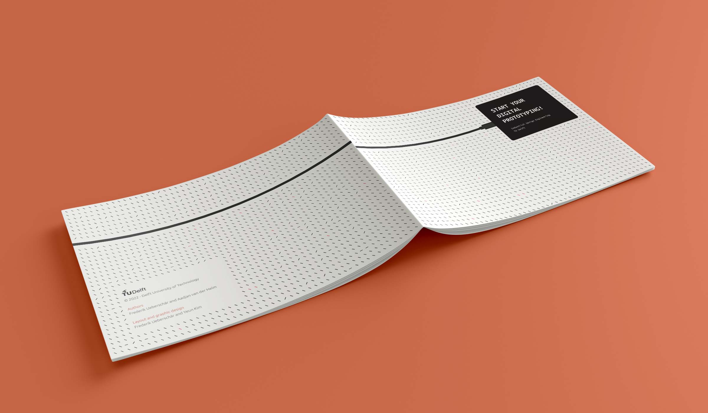

# Starter Booklet

- [Starter Booklet](#starter-booklet)
  - [Illustrations](#illustrations)
  - [Cover page](#cover-page)
  - [Ordering booklets](#ordering-booklets)

The booklet was designed in InDesign, and a package with all links, fonts and a print export can be found at [/starter-booklet/InDesign](./InDesign/).

---

## Illustrations
All visuals for the booklet were designed in Figma, and you can find the source file [here](../physical-box/Figma-working-file/Connected-Interaction-Kit.fig).

---

## Cover page

The generative pattern for the cover was coded in P5, and can be found [here](https://editor.p5js.org/ueberf/sketches/SZFujwDUz).

---

## Ordering booklets
The 400 booklets were ordered at [Pixart Printing](https://www.pixartprinting.nl/printen-tijdschriften-boeken-catalogi/met-nietjes-gebonden/), with the following specifications:

| Specification | Setting |
| :--- | :--- |
| Format | A5 |
| Printing B/W inside | No |
| Page count | 24 pages |
| Paper | Classic demimatt - Mat gecoat |
| Paper weight | 130g |
| Paper weight outside | Same as inside |
| Lamination | None |
| Order amount | 400 |

